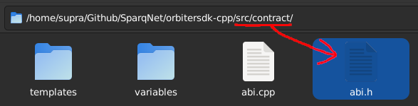
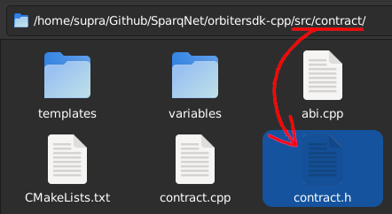
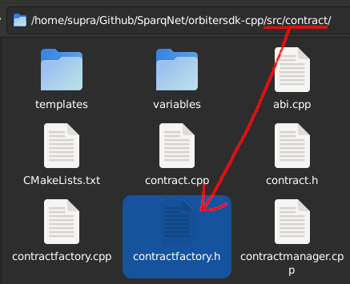
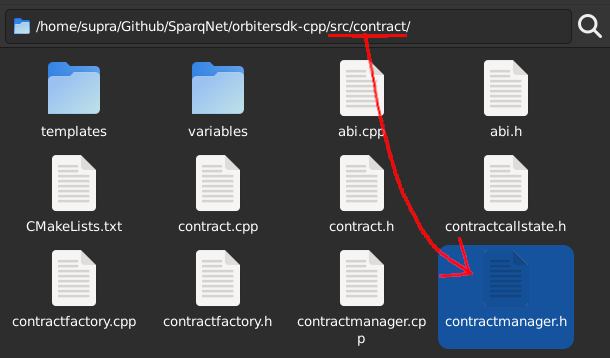
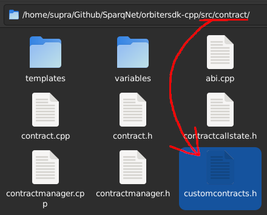
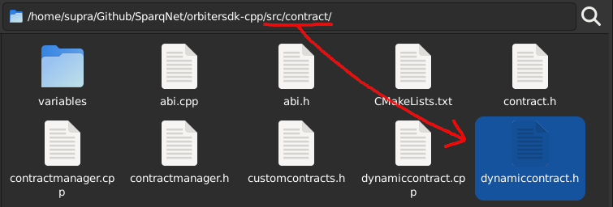
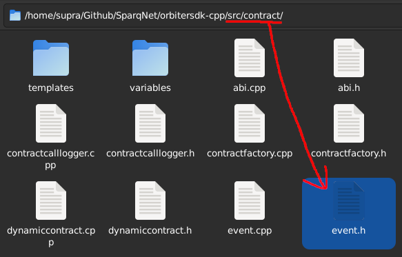
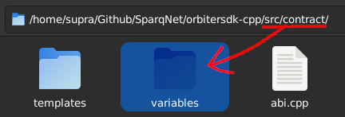
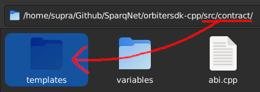

# The contract folder

This subchapter contains a brief overview of each one of the components inside the `src/contract` folder.

## ABI

<figure><figcaption></figcaption></figure>

The `abi.h` file contains the **ABI** namespace - helper functions for handling Solidity ABI types and data natively, as well as the encoding and decoding of said data, also used for C++ <-> EVM inter-operability.

## BaseContract

<figure><figcaption></figcaption></figure>

The `contract.h` file contains the **BaseContract** class - the base from which all smart contracts are derived - as well as the **ContractGlobals** and **ContractLocals** helper classes that provide access to global and local variables, respectively, for those contracts to work.

## ContractFactory

<figure><figcaption></figcaption></figure>

The `contractfactory.h` file contains the **ContractFactory** namespace - helper functions for aiding contract creation, typically used by ContractManager.

## ContractHost

The `contracthost.h` file contains the **ContractHost** class - responsible for managing a single chain of contract execution from beginning to end (including nested calls), including the EVMC host implementation for EVM contracts, holding the execution stack and commit/revert during or at the end of the call (via ContractStack), and allowing both C++ and EVM contract calls and inter-operability.

## ContractManager

<figure><figcaption></figcaption></figure>

The `contractmanager.h` contains the **ContractManager** class - responsible solely for creating and deploying contracts, passing their ownership to State when done.

## ContractStack

The `contractstack.h` file contains the **ContractStack** class - responsible for managing temporary data from contract nested call chains, such as used SafeVariables and altered balances, acting as the one who effectively decides whether those changes are committed or reverted during a contract call. Only one instance of ContractStack is spawned per ContractHost during a call - this ensures the contract call lifecycle is properly contained and state data doesn't spill over other calls.

## CustomContracts

<figure><figcaption></figcaption></figure>

The `customcontracts.h` file contains a tuple that holds all the registered contracts within the blockchain. It is also used as a reference for generating the ABI of said contracts.

## DynamicContract

<figure><figcaption></figcaption></figure>

The `dynamiccontract.h` file contains the **DynamicContract** class - the base from which all Dynamic Contracts are derived (while *BaseContract* is mainly used for Protocol Contracts).

## Event and EventManager

<figure><figcaption></figcaption></figure>

The `event.h` file contains the **Event** and **EventManager** classes, as well as the **EventContainer** typedef for indexing - they represent the subset of contract functionality related to Solidity events.

*Event* is responsible for abstracting a Solidity event's structure and data, while *EventManager* is responsible for maintaining all emitted events within the blockchain. Events are supported for both C++ and EVM contracts.

## The variables subfolder

<figure><figcaption></figcaption></figure>

The `variables` subfolder contains implementations for SafeVariables - special classes that abstract safe versions of variables used within contracts.

## The templates subfolder

<figure><figcaption></figcaption></figure>

The `templates` subfolder contains several contracts used as templates, examples and for internal testing purposes. It's also meant to be the folder where user-coded contracts are stored.

