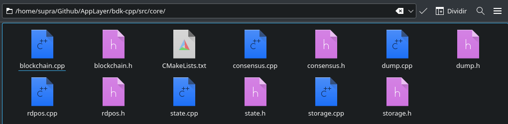

# The core folder

This subchapter contains a brief overview of each one of the components inside the `src/core` folder.

<figure><figcaption></figcaption></figure>

## Blockchain and Syncer

The `blockchain.h` file contains the **Blockchain** and **Syncer** classes.

The **Blockchain** class acts as the mother class that unites all the other components described throughout the docs, including the Syncer. Think of it as "the power button on AppLayer's PC case" - its objective is to be the entry point of the system and act as a mediator for the other components, passing around data to each other, such as (but not limited to):

* The global options singleton
* The database
* The blockchain history/storage (for blocks and contract events)
* The blockchain state
* The rdPoS protocol
* The HTTP and P2P servers

The **Syncer** class is responsible for syncing the blockchain with other nodes in the network, as well as handling proper transaction broadcasts and block creations (if the node happens to be a Validator).

## Consensus

The `consensus.h` file contains the **Consensus** class - responsible for processing blocks and transactions in the blockchain and applying the network's consensus rules into them.

## rdPoS

The `rdpos.h` file contains the **rdPoS** class - the implementation of the _Random Deterministic Proof of Stake_ algorithm used by the AppLayer network - as well as the **rdPoSWorker** and **Validator** classes. rdPoS is also considered a smart contract, but remains part of the AppLayer core protocol.

## State

The `state.h` file contains the **State** class - an abstraction of the blockchain's current state of accounts, balances, nonces, transactions, token balances, deployed contracts and emitted events at the current block in the network, responsible for owning and maintaining all of those and a few other shared inner variables.

A node's state and its data can only be altered through the process of block creation, either by creating a block itself, or receiving one from the network. In AppLayer's case, the class is often used for querying account data (current balance and nonce) and also processing and validating blocks and their transactions, as well as contract calls, following requirements such as (not limited to, but those are some of the most common):

* Ensuring replay protection (e.g. checking if the transaction has already been validated)
* Checking if the sender address exists and has enough balance to make the transaction
* Checking if the sender address nonce is valid (if it matches what was sent in the transaction)
* Checking if the transaction is not already in the mempool, thus avoiding double spends

Not all functions from the class update the state. Check the [Doxygen](https://doxygen.nl) docs for more info on that.

## Storage

The `storage.h` file contains the **Storage** class - an abstraction of the blockchain's history, maintaining a collection of blocks approved and validated by the network, other nodes, or itself through time. Those blocks store transactions, contracts, accounts, and can't be altered once they're in the blockchain, only searched for or read from.

On node initialization, a history of up to 1000 of the most recent blocks is loaded into memory. Those blocks were stored in a previous initialization in the database. If there are no blocks (e.g. the blockchain was just deployed and initialized for the first time), a "genesis" block is automatically created and loaded in memory.

Once a block and its transactions are received from the network, they're stored in memory. If more than 1000 blocks (or 1 million transactions) are stored in memory at a given time, older blocks are periodically saved to the database. This makes the blockchain lightweight memory-wise and extremely responsive.

Searching for and reading from blocks in history is done in several places in the system, so when the Storage and DB classes are working together, they act as the end point of the blockchain's operations history.

## Database dumping

The `dump.h` file contains the **Dumpable**, **DumpManager** and **DumpWorker** classes - together they are responsible for dumping the blockchain's components from memory to disk when required (e.g. blocks, transactions, contracts, the state itself, etc.)

_Dumpable_ is an abstraction of a dumpable object - that is, any component that inherits it is able to dump itself to disk. All classes that inherit it must implement their own dumping routine accordingly.

_DumpManager_ is the class that manages a list of Dumpable components in the blockchain, iterating through each of them and dumping them one by one when told to.

_DumpWorker_ acts as a worker thread for DumpManager, doing the actual work of dumping each Dumpable component sent by DumpManager in a separate thread. This allows for parallel dumps, speeding up the process significantly, which is important when there are many objects or particularly heavy ones (e.g. State) that need to be dumped ASAP without hanging the entire blockchain.
