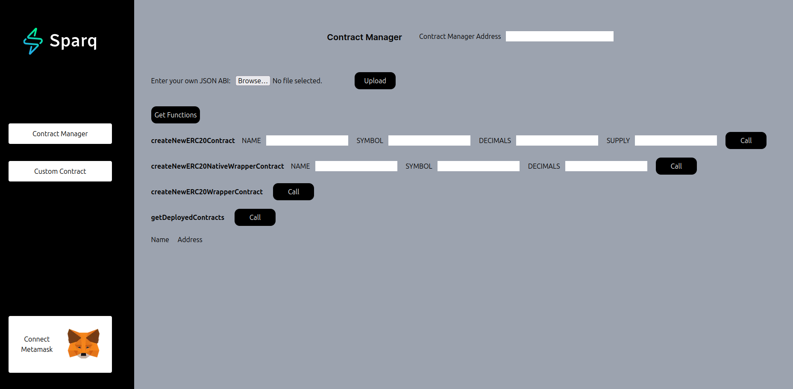
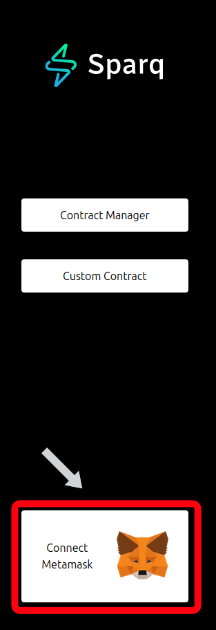
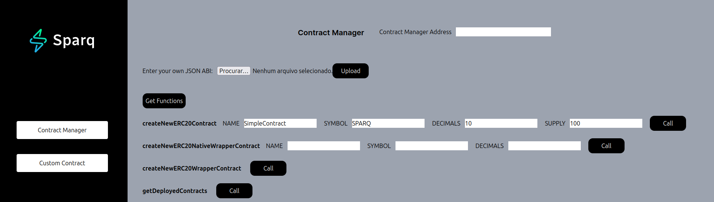
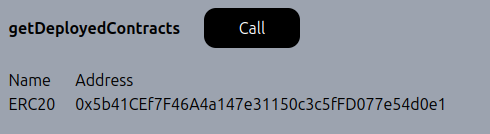

# Contract Tester

Sparq Labs has developed a web application called [Contract Tester](https://github.com/SparqNet/contract-tester), for testing the logic of customized contracts in a simple, fast and intuitive way.

**Step 1 - Cloning the repository**

First, clone the repository to your local device:

```
git clone https://github.com/SparqNet/contract-tester
```

**Step 2 - Installing dependencies**

After cloning the repository, install NPM and the required dependencies from it:

```
sudo apt install npm && sudo npm install --global yarn next react@latest react-dom
```

**Step 3 - Deploying a local testnet**

As you're testing the interaction of your customized contracts with the OrbiterSDK testnet, you should configure your environment and run a local testnet. See [3.3](https://github.com/SparqNet/sparq-docs/blob/main/Sparq\_en-US/ch3/3-3.md) for more info.

**Step 4 - Deploying the application**

Once you're ready, go to the repo's root folder and deploy the contract tester:

```
yarn install && yarn build && yarn start -p PORT_NUMBER
```

`-p PORT_NUMBER` is optional, in case you want to deploy to a port of your choosing, otherwise you can omit it. The default port is `3000`, so, if you already have an application running on this port, you should use a different one using this flag, or stop the application running on port `3000` with the command `sudo kill $(sudo lsof -t -i:3000)`.

**Step 5 - Using the application**

You should now be able to access the contract tester through `http://localhost:3000` (or the port you chose in the previous step). The application should look like this:

<figure><figcaption></figcaption></figure>

When you open the home page, it'll automatically ask for you to connect to MetaMask. You can also click on the "Connect MetaMask" button on the bottom of the left sidebar to do it manually:

<figure><figcaption></figcaption></figure>

The application has two main sections: **Contract Manager** and **Custom Contract**. The first one shows the function calls for the default `ContractManager` contract that we have supplied within the OrbiterSDK project, and the second one is where you will call your custom contracts.

#### Contract Manager

If you want to use the default contract, just type the required parameters on the function you want to call, and call it by clicking the "Call" button beside it. For example, let's create a new contract with the following parameters, based on the `SimpleContract` example in [3.4](https://github.com/SparqNet/sparq-docs/blob/main/Sparq\_en-US/ch3/3-4.md):

* `NAME`: "SimpleContract"
* `SYMBOL`: "SPARQ"
* `DECIMALS`: 10
* `SUPPLY`: 100

<figure><figcaption></figcaption></figure>

After that, you should wait for the transaction to be mined and the contract to be created. You can check the transaction status on MetaMask. After the transaction is mined, you can click on the "getDeployedContracts" button to see the address of the contract you just created:

<figure><figcaption></figcaption></figure>

If you want to create a custom version of `ContractManager`, you will need to follow these steps:

1. Deploy the custom contract to the network (see [3.4](https://github.com/SparqNet/sparq-docs/blob/main/Sparq\_en-US/ch3/3-4.md) for more info on how to do it)
2. Take the custom contract address and put it at the top, in the “Contract Manager Address” field
3. Add the custom contract's ABI by clicking the button next to the "Enter your own JSON ABI" label, choosing your JSON ABI file, and then clicking "Upload"
4. Finally, click the “Get Functions” button to show the custom contract's functions and input fields

**NOTE**: We advise against removing the “getDeployedContracts” function on any custom contract implementations you create. We have a statically placed table at the end of the page for quick reference to all the contracts deployed on the network by the contract manager. Use this to quickly fetch the addresses of deployed contracts to be able to interact with them.

#### Custom Contract

If you want to interact with your own custom contracts, just remember these steps:

1. Develop the contract and deploy it to the network
2. Get the contract address by creating a new contract instance on the Contract Manager tab and clicking on the "Get Deployed Contracts" button
3. Use a tool to generate the contract JSON ABI
4. Go to the Custom Contract tab and paste the contract address in the "Contract Address" field and upload the ABI JSON file
5. Click on the "Get Functions" button and interact with the contract

First, make sure the contract is defined and added to the Contract Manager so you can deploy an instance of the contract. After deploying, grab the address from the “Deployed Contracts” list, click on the “Custom Contract” tab and repeat steps 1-4 as you did earlier in the Contract Manager page. Every time you want to change contracts, deploy a new one, change the address and ABI using the inputs, and get the functions.

**NOTE**: If you are passing an array as input values, just separate them using commas and the application will make all the necessary changes.

Let's use the `SimpleContract` example from [3.4](https://github.com/SparqNet/sparq-docs/blob/main/Sparq\_en-US/ch3/3-4.md), because we already registered it earlier on the Contract Manager section. Firstly, develop the contract and deploy it to the network. After that, you can use the Contract Tester to interact with it. The solidity code for the contract is:

```
// SPDX-License-Identifier: MIT
pragma solidity ^0.8;

contract SimpleContract {
  address owner;
  string name;
  uint256 value;

  constructor(string memory argName, uint256 argValue) {
    owner = msg.sender;
    name = argName;
    value = argValue;
  }

  function getName() public view returns(string memory) {
    return name;
  }

  function getValue() public view returns(uint256) {
    return value;
  }

  function setName(string memory argName) public {
    require(msg.sender == owner, "Not owner");
    name = argName;
  }

  function setValue(uint256 argValue) public {
    require(msg.sender == owner, "Not owner");
    value = argValue;
  }
}
```

We can use our own ABI generator tool described in [3.4](https://github.com/SparqNet/sparq-docs/blob/main/Sparq\_en-US/ch3/3-4.md), or a third-party one like [Remix IDE](https://remix.ethereum.org) to generate the contract ABI. If using Remix, first create a Solidity file (.sol extension) and paste the code above. After that, you can compile the contract by clicking on the "Compile" button on the left sidebar. You should see something like this:

<figure><figcaption></figcaption></figure>

Now, you can click on the "ABI" button to copy the ABI JSON structure of the `SimpleContract`. Finally, you can just save it in a json file and use it in the Contract Tester. This is the JSON ABI for the `SimpleContract`:

```
[
	{
		"inputs": [
			{
				"internalType": "string",
				"name": "argName",
				"type": "string"
			},
			{
				"internalType": "uint256",
				"name": "argValue",
				"type": "uint256"
			}
		],
		"stateMutability": "nonpayable",
		"type": "constructor"
	},
	{
		"inputs": [],
		"name": "getName",
		"outputs": [
			{
				"internalType": "string",
				"name": "",
				"type": "string"
			}
		],
		"stateMutability": "view",
		"type": "function"
	},
	{
		"inputs": [],
		"name": "getValue",
		"outputs": [
			{
				"internalType": "uint256",
				"name": "",
				"type": "uint256"
			}
		],
		"stateMutability": "view",
		"type": "function"
	},
	{
		"inputs": [
			{
				"internalType": "string",
				"name": "argName",
				"type": "string"
			}
		],
		"name": "setName",
		"outputs": [],
		"stateMutability": "nonpayable",
		"type": "function"
	},
	{
		"inputs": [
			{
				"internalType": "uint256",
				"name": "argValue",
				"type": "uint256"
			}
		],
		"name": "setValue",
		"outputs": [],
		"stateMutability": "nonpayable",
		"type": "function"
	}
]
```

Now, you can use the Contract Tester to interact with the deployed `SimpleContract`. First, you need to get the address of the deployed contract. You can do that by going to the Contract Manager tab and clicking on the "Get Deployed Contracts" button. Remember that we already did this step and our contract address is `0x5b41CEf7F46A4a147e31150c3c5fFD077e54d0e1`. Then, go to the Custom Contract tab and paste the address in the "Contract Address" field. After that, you can upload the ABI JSON file and click on the "Get Functions" button. You should see something like this:

<figure><figcaption></figcaption></figure>

Now you can interact with the contract. You can set the name and value by using the "setName" and "setValue" functions, and get the name and value by using the "getName" and "getValue" functions. You can also check the transactions on Metamask.
