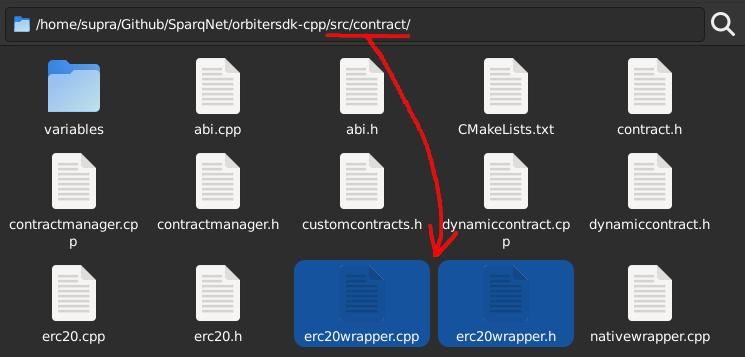

# Creating a Dynamic Contract (Advanced)

Let's create a simple Dynamic Contract that can be used for depositing and withdrawing ERC20 tokens. This subchapter assumes you went through [3.4](https://github.com/SparqNet/sparq-docs/blob/main/Sparq\_en-US/ch3/3-4.md) first, as most of the heavy explanations were done there.

This example uses an already existing contract within the project - the `ERC20Wrapper` contract. This is due to the fact that `ERC20Wrapper` is a very simple contract, while it shows differences between Solidity and OrbiterSDK contracts when calling other contracts. Check the `src/contract/erc20wrapper.h` and `src/contract/erc20wrapper.cpp` files for reference:

<figure><figcaption></figcaption></figure>

### Solidity Example

We'll be using the following Solidity code as a reference:

```
// SPDX-License-Identifier: MIT
pragma solidity ^0.8;

import "@openzeppelin/contracts/token/ERC20/IERC20.sol";

contract ERC20Wrapper {
  mapping (address => mapping (address => uint256)) private _tokensAndBalances;

  function getContractBalance(address token) public view returns(uint256) {
    IERC20 erc20 = IERC20(token);
    return erc20.balanceOf(address(this));
  }

  function getUserBalance(address token, address user) public view returns (uint256) {
    return _tokensAndBalances[token][user];
  }

  function withdraw(address token, uint256 value) public {
    require(_tokensAndBalances[token][msg.sender] >= value, "User doesn't have enough balance");
    IERC20 erc20 = IERC20(token);
    _tokensAndBalances[token][msg.sender] -= value;
    erc20.transfer(msg.sender, value);
  }

  function transferTo(address token, address to, uint256 value) public {
    require(_tokensAndBalances[token][msg.sender] >= value, "User doesn't have enough balance");
    IERC20 erc20 = IERC20(token);
    _tokensAndBalances[token][msg.sender] -= value;
    erc20.transfer(to, value);
  }

  function deposit(address token, uint256 value) public {
    IERC20 erc20 = IERC20(token);
    erc20.transferFrom(msg.sender, address(this), value);
    _tokensAndBalances[token][msg.sender] += value;
  }
}
```

#### Step 1 - Creating the files

In order to recreate this contract, first we need to create the header and source files for it (`erc20wrapper.h` and `erc20wrapper.cpp`, as stated above), then add both files to the `CMakeLists.txt` file inside the same folder:

```
set(CONTRACT_HEADERS
  ...
  ${CMAKE_SOURCE_DIR}/src/contract/erc20wrapper.h
  ...
)
set(CONTRACT_SOURCES
  ...
  ${CMAKE_SOURCE_DIR}/src/contract/erc20wrapper.cpp
  ...
)
```

#### Step 2 - Creating the contract header

Inside `erc20wrapper.h`, let's implement the header:

```
class ERC20Wrapper : public DynamicContract {
  private:
    // ERC20 Address => UserAddress/UserBalance
    // mapping(address => mapping(address => uint256)) internal _tokensAndBalances;
    SafeUnorderedMap<Address,std::unordered_map<Address, uint256_t, SafeHash>> _tokensAndBalances;

    // Override this to register your contract's own functions.
    void registerContractFunctions() override;

  public:
    // Constructor for building a new contract from scratch.
    ERC20Wrapper(
      ContractManager::ContractManagerInterface &interface,
      const Address& address,
      const Address& creator,
      const uint64_t& chainId,
      const std::unique_ptr<DB> &db
    );
    
    // Constructor for loading the contract from the database.
    ERC20Wrapper(
      ContractManager::ContractManagerInterface &interface,
      const Address& contractAddress,
      const std::unique_ptr<DB> &db
    );

    // Destructor. Override this to save all your state variables.
    ~ERC20Wrapper() override;

    // function getContractBalance(address _token) public view returns (uint256) { return _tokensAndBalances[_token][address(this)]; }
    std::string getContractBalance(const Address& token) const;

    // function getUserBalance(address _token, address _user) public view returns (uint256) { return _tokensAndBalances[_token][_user]; }
    std::string getUserBalance(const Address& token, const Address& user) const;

    // function withdraw (address _token, uint256 _value) public returns (bool)
    void withdraw(const Address& token, const uint256_t& value);

    // function transferTo(address _token, address _to, uint256 _value) public returns (bool)
    void transferTo(const Address& token, const Address& to, const uint256_t& value);

    // function deposit(address _token, uint256 _value) public returns (bool)
    void deposit(const Address& token, const uint256_t& value);
};
```

Here, we recreated the contract's functions but also added a few extra functions (explained on the previous sections). In short:

* We create two constructors - one for creating the contract from scratch, and another for loading it from the database
* We override the `registerContractFunctions()` function
* We override the destructor
* We use private SafeVariables (in this case, `SafeUnorderedMap`) to handle the contract's actual variables

#### Step 3 - Implementing the contract constructors and destructor

Inside `erc20wrapper.cpp`, let's implement both constructors:

```
// Create the contract on the spot
ERC20Wrapper::ERC20Wrapper(
  ContractManager::ContractManagerInterface &interface,
  const Address& address,
  const Address& creator,
  const uint64_t& chainId,
  const std::unique_ptr<DB> &db
) : DynamicContract(interface, "ERC20Wrapper", address, creator, chainId, db), _tokensAndBalances(this) {
  registerContractFunctions();
  updateState(true);
}

// Load the contract directly from the database
ERC20Wrapper::ERC20Wrapper(
  ContractManager::ContractManagerInterface &interface,
  const Address& contractAddress,
  const std::unique_ptr<DB> &db
) : DynamicContract(interface, contractAddress, db), _tokensAndBalances(this) {
  auto tokensAndBalances = this->db->getBatch(
    DBPrefix::contracts + this->getContractAddress().get() + "_tokensAndBalances"
  );
  for (const auto& dbEntry : tokensAndBalances) {
    this->_tokensAndBalances[Address(dbEntry.key, true)][Address(dbEntry.value.substr(0, 20), true)] = Utils::fromBigEndian<uint256_t>(dbEntry.value.substr(20));
  }
  registerContractFunctions();
  updateState(true);
}
```

The first constructor will create a new contract from scratch, as there is no previous existing contract to load. Because of that, you are required to initialize _all_ the variables of your contract by hand (address, name, etc.), within the `DynamicContract` constructor (notice that your contract's name - "ERC20Wrapper" - is the same as your contract's class name - `ERC20Wrapper` - this match is _mandatory_, otherwise a segfault will happen).

The second constructor will load the contract variables (address, name, etc.) from the database by itself, but you are required to load the variables of your contract on your own from there as well. Use `DBPrefix::contract + this->getContractAddress()` as the prefix for the database key.

Both constructors have to call `registerContractFunctions()` as well as `updateState(true)` at the end. Those will be explained further.

Now, let's implement the destructor, which is responsible for saving the current information within the contract back to the database:

```
ERC20Wrapper::~ERC20Wrapper() {
  DBBatch tokensAndBalancesBatch;
  for (auto it = _tokensAndBalances.cbegin(); it != _tokensAndBalances.cend(); it++) {
    for (auto it2 = it->second.cbegin(); it2 != it->second.cend(); it2++) {
      std::string key = it->first.get();
      std::string value;
      value += it2->first.get();
      value += Utils::uintToBytes(it2->second);
      tokensAndBalancesBatch.puts.emplace_back(DBEntry(key, value));
    }
  }
  this->db->putBatch(tokensAndBalancesBatch, DBPrefix::contracts + this->getContractAddress().get() + "_tokensAndBalances");
  return;
}
```

Keep in mind that, for the prefix of the database, we use `DBPrefix::contracts + this->getContractAddress().get() + "_tokensAndBalances"`. This is the same prefix that we used on the constructor to load the contract variables from the database.

#### Step 4 - Implementing the contract functions

This step is pretty straightforward - _view_ functions should be `const` and return a `std::string` with the ABI encoded result, while _non-view/callable_ functions should be non-`const` and return `void`:

```
// view function
std::string ERC20Wrapper::getContractBalance(const Address& token) const {
  auto* ERC20Token = this->getContract<ERC20>(token);
  return ERC20Token->balanceOf(this->getContractAddress());
}

// view function
std::string ERC20Wrapper::getUserBalance(const Address& token, const Address& user) const {
  auto it = this->_tokensAndBalances.find(token);
  if (it == this->_tokensAndBalances.end()) return ABI::Encoder({0}).getRaw();
  auto itUser = it->second.find(user);
  if (itUser == it->second.end()) return ABI::Encoder({0}).getRaw();
  return ABI::Encoder({itUser->second}).getRaw();
}

// callable function
void ERC20Wrapper::withdraw(const Address& token, const uint256_t& value) {
  auto it = this->_tokensAndBalances.find(token);
  if (it == this->_tokensAndBalances.end()) throw std::runtime_error("Token not found");
  auto itUser = it->second.find(this->getCaller());
  if (itUser == it->second.end()) throw std::runtime_error("User not found");
  if (itUser->second <= value) throw std::runtime_error("Not enough balance");
  itUser->second -= value;
  ABI::Encoder encoder({this->getCaller(), value}, "transfer(address,uint256)");
  this->callContract(token, encoder);
}

// callable function
void ERC20Wrapper::transferTo(const Address& token, const Address& to, const uint256_t& value) {
  auto it = this->_tokensAndBalances.find(token);
  if (it == this->_tokensAndBalances.end()) throw std::runtime_error("Token not found");
  auto itUser = it->second.find(this->getCaller());
  if (itUser == it->second.end()) throw std::runtime_error("User not found");
  if (itUser->second <= value) throw std::runtime_error("Not enough balance");
  itUser->second -= value;
  ABI::Encoder encoder({to, value}, "transfer(address,uint256)");
  this->callContract(token, encoder);
}

// callable function
void ERC20Wrapper::deposit(const Address& token, const uint256_t& value) {
  ABI::Encoder encoder({this->getCaller(), this->getContractAddress(), value}, "transferFrom(address,address,uint256)");
  this->callContract(token, encoder);
  this->_tokensAndBalances[token][this->getCaller()] += value;
}
```

Keep in mind that, for the prefix of the database, we use `DBPrefix::contracts + this->getContractAddress().get() + "_tokensAndBalances"`. This is the same prefix that we used on the constructor to load the contract variables from the database.

#### Step 4 - Creating the contract functions

This step is pretty straightforward - functions that are callable by a transaction should be non-`const` and return `void`, while view functions should be `const` and return a `std::string` with the ABI encoded result. Check the following examples:

```
// view function
std::string ERC20Wrapper::getContractBalance(const Address& token) const {
  auto* ERC20Token = this->getContract<ERC20>(token);
  return ERC20Token->balanceOf(this->getContractAddress());
}

// view function
std::string ERC20Wrapper::getUserBalance(const Address& token, const Address& user) const {
  auto it = this->_tokensAndBalances.find(token);
  if (it == this->_tokensAndBalances.end()) return ABI::Encoder({0}).getRaw();
  auto itUser = it->second.find(user);
  if (itUser == it->second.end()) return ABI::Encoder({0}).getRaw();
  return ABI::Encoder({itUser->second}).getRaw();
}

// callable function
void ERC20Wrapper::withdraw(const Address& token, const uint256_t& value) {
  auto it = this->_tokensAndBalances.find(token);
  if (it == this->_tokensAndBalances.end()) throw std::runtime_error("Token not found");
  auto itUser = it->second.find(this->getCaller());
  if (itUser == it->second.end()) throw std::runtime_error("User not found");
  if (itUser->second <= value) throw std::runtime_error("Not enough balance");
  itUser->second -= value;
  ABI::Encoder encoder({this->getCaller(), value}, "transfer(address,uint256)");
  this->callContract(token, encoder);
}

// callable function
void ERC20Wrapper::transferTo(const Address& token, const Address& to, const uint256_t& value) {
  auto it = this->_tokensAndBalances.find(token);
  if (it == this->_tokensAndBalances.end()) throw std::runtime_error("Token not found");
  auto itUser = it->second.find(this->getCaller());
  if (itUser == it->second.end()) throw std::runtime_error("User not found");
  if (itUser->second <= value) throw std::runtime_error("Not enough balance");
  itUser->second -= value;
  ABI::Encoder encoder({to, value}, "transfer(address,uint256)");
  this->callContract(token, encoder);
}

// callable function
void ERC20Wrapper::deposit(const Address& token, const uint256_t& value) {
  ABI::Encoder encoder({this->getCaller(), this->getContractAddress(), value}, "transferFrom(address,address,uint256)");
  this->callContract(token, encoder);
  this->_tokensAndBalances[token][this->getCaller()] += value;
}
```

#### Step 5 - Calling functions from other contracts

**View functions**

In order to call another contract's view function, you can get a pointer to it using the global `getContract()` function. It is automatically protected in the case of casting a wrong typed contract or calling an inexistent contract, and returns a `std::string` with the respective ABI encoded result:

```
std::string ERC20Wrapper::getContractBalance(const Address& token) const {
  auto* ERC20Token = this->getContract<ERC20>(token);
  return ERC20Token->balanceOf(this->getContractAddress());
}
```

**Non-view/Callable functions**

In order to call a non-view/callable function, you need to use the `callContract()` function. You must encode the ABI of the function you want to call - in this example, we are calling the `transferFrom` function from another ERC20 contract, which is encoded as `transferFrom(address,address,uint256)`, and its parameters are the caller, the contract address and the value, respectively, encoded as `{this->getCaller(), this->getContractAddress(), value}`:

```
void ERC20Wrapper::deposit(const Address& token, const uint256_t& value) {
  ABI::Encoder encoder({this->getCaller(), this->getContractAddress(), value}, "transferFrom(address,address,uint256)");
  this->callContract(token, encoder);
  this->_tokensAndBalances[token][this->getCaller()] += value;
}
```

As this contract is consuming the ERC20 balance of another contract, you first need to approve the contract to spend the tokens. This can be done in the same manner as Solidity.

#### Step 6 - Registering the contract's functions

Once we're done with implementing the contract, we need to override `registerContractFunction()` with the proper functions for them to be registered and able to be called by an RPC `eth_call` or a transaction. This is done by calling the following functions on the derived contract:

```
void registerFunction(const std::string& functor, std::function<void(const ethCallInfo& tx)> f);
void registerPayableFunction(const std::string& functor, std::function<void(const ethCallInfo& tx)> f);
void registerViewFunction(const std::string& functor, std::function<std::string(const ethCallInfo& str)> f);
```

Each function should be used for their effective purpose:

* `registerFunction()` is used to register a _callable_ function (a function that is called by a transaction)
* `registerPayableFunction()` is used to register a _callable_ AND _payable_ function
* `registerViewFunction()` is used to register a _view_ function

The `functor` argument should be the function signature by Solidity standards, as in:

* `getContractBalance(address token)` -> `keccak256("getContractBalance(address)").substr(0,4)` -> `0x43ab265f`
* `getUserBalance(address token, address user)` -> `keccak256("getUserBalance(address,address)").substr(0,4)` -> `0x6805d6ad`
* And so on and so forth...

The `function` argument should be a lambda function, responsible for parsing the `ethCallInfo` argument and calling the proper function.

`ethCallInfo` is a `std::tuple` with the following information:

| Index | Description                          | Type        |
| ----- | ------------------------------------ | ----------- |
| 0     | From (where the call is coming from) | Address     |
| 1     | To (where the call is going to)      | Address     |
| 2     | GasLimit                             | uint256\_t  |
| 3     | GasPrice                             | uint256\_t  |
| 4     | Value                                | uint256\_t  |
| 5     | Data                                 | std::string |

You can access each information by using `std::get<index>(ethCallInfo)`, e.g. `std::get<5>(ethCallInfo)` will get the data itself. Then, `data.substr(0,4)` will be the function signature and the remaining data will be the ABI encoded parameters.

We provide an [ABI namespace](https://github.com/SparqNet/orbitersdk-cpp/blob/main/src/contract/abi.h), which contains an encoder and decoder which you can use to encode and/or decode Solidity's ABI strings in order to call a function.

Our implementation would look something like this:

```
void ERC20Wrapper::registerContractFunctions() {
  this->registerViewFunction(Hex::toBytes("0x43ab265f"), [this](const ethCallInfo &callInfo) {
    std::vector<ABI::Types> types = { ABI::Types::address };
    ABI::Decoder decoder(types, std::get<5>(callInfo).substr(4));
    return this->getContractBalance(decoder.getData<Address>(0));
  });
  this->registerViewFunction(Hex::toBytes("0x6805d6ad"), [this](const ethCallInfo &callInfo) {
    std::vector<ABI::Types> types = { ABI::Types::address, ABI::Types::address };
    ABI::Decoder decoder(types, std::get<5>(callInfo).substr(4));
    return this->getUserBalance(decoder.getData<Address>(0), decoder.getData<Address>(1));
  });
  this->registerFunction(Hex::toBytes("0xf3fef3a3"), [this](const ethCallInfo &callInfo) {
    std::vector<ABI::Types> types = { ABI::Types::address, ABI::Types::uint256 };
    ABI::Decoder decoder(types, std::get<5>(callInfo).substr(4));
    this->withdraw(decoder.getData<Address>(0), decoder.getData<uint256_t>(1));
  });
  this->registerFunction(Hex::toBytes("0xa5f2a152"), [this](const ethCallInfo &callInfo) {
    std::vector<ABI::Types> types = { ABI::Types::address, ABI::Types::address, ABI::Types::uint256 };
    ABI::Decoder decoder(types, std::get<5>(callInfo).substr(4));
    this->transferTo(decoder.getData<Address>(0), decoder.getData<Address>(1), decoder.getData<uint256_t>(2));
  });
  this->registerFunction(Hex::toBytes("0x47e7ef24"), [this](const ethCallInfo &callInfo) {
    std::vector<ABI::Types> types = { ABI::Types::address, ABI::Types::uint256 };
    ABI::Decoder decoder(types, std::get<5>(callInfo).substr(4));
    this->deposit(decoder.getData<Address>(0), decoder.getData<uint256_t>(1));
  });
  return;
}
```

#### Step 7 - Registering the contract in ContractManager

Once your contract is done, you need to register it within the `ContractManager` class itself. In order to do this, two functions have to be added to it, and the `ethCall()` functions and its constructor have to be modified. Let's go back to `src/contract/contractmanager.h` and `src/contract/contractmanager.cpp`:

<figure><figcaption></figcaption></figure>

First, in `contractmanager.h` let's declare two new _private_ functions within `ContractManager`, both taking `ethCallInfo` as an argument. The first function should create a new instance of the contract, and the second function should verify if the call to create the contract is valid.

These functions should be called `createNewCONTRACTNAMEContract()` and `validateCreateNewCONTRACTNAMEContract()`, respectively. Replace `CONTRACTNAME` with the name of your contract. In our example, those functions would be aptly named as `createNewERC20WrapperContract()` and `validateCreateNewERC20WrapperContract()`, respectively.

```
class ContractManager : BaseContract {
  private:
    // ...previous source code...

    // Create a new ERC20Wrapper Contract.
    // function createNewERC20WrapperContract() public {}
    void createNewERC20WrapperContract(const ethCallInfo& callInfo);

    // Check if transaction can actually create a new ERC20 contract.
    void validateCreateNewERC20WrapperContract(const ethCallInfo& callInfo) const;

    // ... next source code...
};
```

Then, in `contractmanager.cpp`, include the header file (e.g. `#include "erc20wrapper.h"`) and properly implement those functions:&#x20;

```
void ContractManager::createNewERC20WrapperContract(const ethCallInfo& callInfo) {
  if (this->caller != this->getContractCreator()) throw std::runtime_error("Only contract creator can create new contracts");

  // Check if desired contract address already exists
  const auto derivedContractAddress = this->deriveContractAddress(callInfo);
  if (this->contracts.contains(derivedContractAddress)) throw std::runtime_error("Contract already exists");

  std::unique_lock lock(this->contractsMutex);
  for (const auto& [protocolContractName, protocolContractAddress] : ProtocolContractAddresses) {
    if (protocolContractAddress == derivedContractAddress) throw std::runtime_error("Contract already exists");
  }

  this->contracts.insert(std::make_pair(derivedContractAddress, std::make_unique<ERC20Wrapper>(
    this->interface, derivedContractAddress, this->getCaller(), this->options->getChainID(), this->db
  )));
}

void ContractManager::validateCreateNewERC20WrapperContract(const ethCallInfo& callInfo) const {
  if (this->caller != this->getContractCreator()) throw std::runtime_error("Only contract creator can create new contracts");

  // Check if desired contract address already exists
  const auto derivedContractAddress = this->deriveContractAddress(callInfo);
  if (this->contracts.contains(derivedContractAddress)) throw std::runtime_error("Contract already exists");

  std::unique_lock lock(this->contractsMutex);
  for (const auto& [protocolContractName, protocolContractAddress] : ProtocolContractAddresses) {
    if (protocolContractAddress == derivedContractAddress) throw std::runtime_error("Contract already exists");
  }
}
```

The `create` function should create a new instance of the contract and add it to the `ContractManager`, and the `validate` function should only parse the ABI and verify if the parameters are correct.

On both functions, the first if block enforces that only the chain creator can create new contracts, the second if block checks if the contract already exists, and the third if block checks if the contract address is already used by a Protocol Contract, which is not registered in the `ContractManager`.

Now, let's modify the `ethCall()` functions - under `ContractManager::ethCall(const ethCallInfo& callInfo)` you need to parse the functor and call the corresponding function, like this:

```
void ContractManager::ethCall(const ethCallInfo& callInfo) {
  std::string functor = std::get<5>(callInfo).substr(0, 4);
  if (this->getCommit()) {
    ... some if blocks ...
    // function createNewERC20WrapperContract() public {}
    if (functor == Hex::toBytes("0x97aa51a3")) {
      this->createNewERC20WrapperContract(callInfo);
      return;
    }
    ... more if blocks ...
  } else {
    ... some if blocks ...
    if (functor == Hex::toBytes("0x97aa51a3")) {
      this->validateCreateNewERC20WrapperContract(callInfo);
      return;
    }
    ... more if blocks ...
  }
  throw std::runtime_error("Invalid function call");
}
```

If you have multiple contracts, you would do one if block per contract that you need to register, one after the other. You can register as many contracts as you want, though your `ethCall()` function might get a little "bloated" if you have too many of them.

#### Step 8 - Compiling it all

Finally, `cd` back to the project's root, run `./scripts/AIO-setup.sh` to setup your local network, deploy your contract using the chain owner's private key and test your contract's compatibility with your favorite frontend tool.

In order to deploy your contract, you must call the respective `createNewCONTRACTNAMEContract()` with a transaction to the `ContractManager`'s address. The function will create a new contract and return the address of the new contract, you can then use the address to interact with the contract.

It is also possible to create tests using the internal test framework (Catch2) - see the links for more information:

* [tests/contract/erc20wrapper.cpp](https://github.com/SparqNet/orbitersdk-cpp/blob/main/tests/contract/erc20wrapper.cpp)
* [tests/contract/nativewrapper.cpp](https://github.com/SparqNet/orbitersdk-cpp/blob/main/tests/contract/nativewrapper.cpp)
* [src/contract/nativewrapper.h](https://github.com/SparqNet/orbitersdk-cpp/blob/main/src/contract/nativewrapper.h)
* [src/contract/nativewrapper.cpp](https://github.com/SparqNet/orbitersdk-cpp/blob/main/src/contract/nativewrapper.cpp)
* [src/contract/erc20.h](https://github.com/SparqNet/orbitersdk-cpp/blob/main/src/contract/erc20.h)
* [src/contract/erc20.cpp](https://github.com/SparqNet/orbitersdk-cpp/blob/main/src/contract/erc20.cpp)
