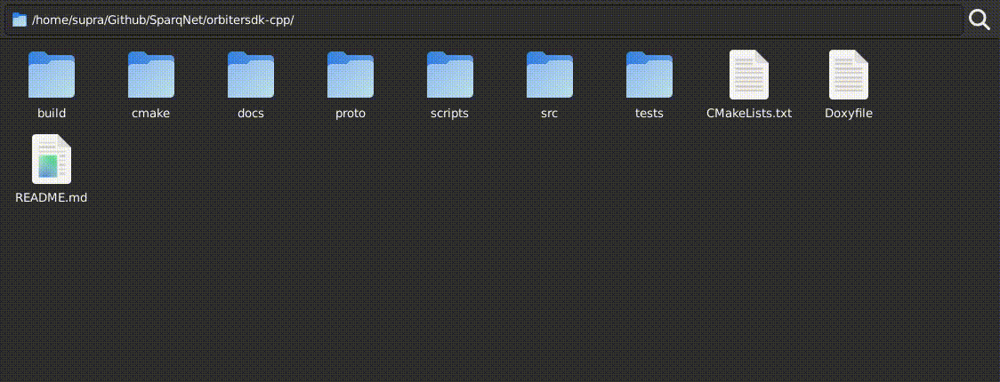
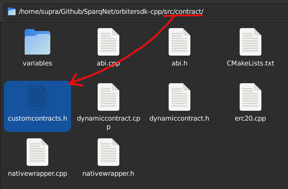
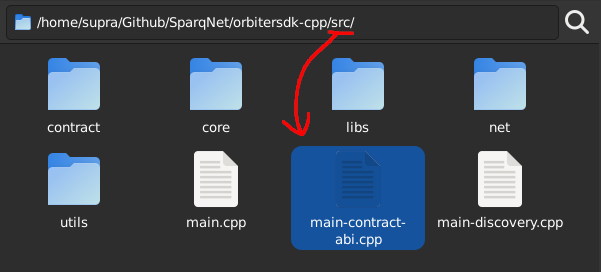
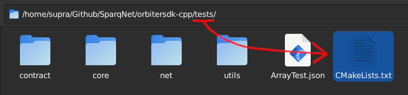

# Creating a Dynamic Contract (Simple)

Let's create a simple Solidity contract that allows two private variables to be changed by the owner of the contract. We will call this contract `SimpleContract`.

### Solidity Example

We'll be using the following Solidity code as a reference:

```
// SPDX-License-Identifier: MIT
pragma solidity ^0.8;

contract SimpleContract {
  address owner;
  string name;
  uint256 value;

  constructor(string memory argName, uint256 argValue) {
    owner = msg.sender;
    name = argName;
    value = argValue;
  }

  function getName() public view returns(string memory) {
    return name;
  }

  function getValue() public view returns(uint256) {
    return value;
  }

  function setName(string memory argName) public {
    require(msg.sender == owner, "Not owner");
    name = argName;
  }

  function setValue(uint256 argValue) public {
    require(msg.sender == owner, "Not owner");
    value = argValue;
  }
}
```

### Step 1 - Creating the Files

To recreate this contract as a native Sparq contract, first we need to create its header (`.h`) and source (`.cpp`) files, as is customary in C++ development - the header will have the definition of our contract class, and the source will have its implementation details.

Go to your local testnet's root folder, into the `src/contract` subfolder, and create two new files - `simplecontract.h` and `simplecontract.cpp`. Those files will contain the declaration and definition of your contract's logic, respectively.

<figure><figcaption></figcaption></figure>

Then, add both files to the `CMakeLists.txt` file in the same folder, so they can be compiled with the project:

```
set(CONTRACT_HEADERS
  ...
  ${CMAKE_SOURCE_DIR}/src/contract/simplecontract.h
  ...
)
set(CONTRACT_SOURCES
  ...
  ${CMAKE_SOURCE_DIR}/src/contract/simplecontract.cpp
  ...
)
```

### Step 2 - Declaring the Contract Class

Open the header file (`simplecontract.h`) and add the following lines:

```
#ifndef SIMPLECONTRACT_H
#define SIMPLECONTRACT_H

#include "dynamiccontract.h"
#include "variables/safestring.h"
#include "variables/safeuint256_t.h"

class SimpleContract : public DynamicContract {
  private:
    ...
  public:
    ...
};

#endif // SIMPLECONTRACT_H
```

This is a simple skeleton so we can start building the proper contract. From top to bottom:

* We create [include guards](https://en.wikipedia.org/wiki/Include\_guard) as a safety measure
* We include the `DynamicContract` class and two SafeVariable classes for the contract's inner variables - `SafeString` and `SafeUint256_t`, which represent a Solidity `string` and `uint256` type, respectively
* We create our `SimpleContract` class, inherit it from `DynamicContract`, and leave some space for the private and public members that will be coded next

#### Step 2.1 - Declaring the Contract Variables and Functions

Now we can declare the variables of the contract and their respective functions in the header. We have to pay attention to some rules described earlier in [3-2](https://github.com/SparqNet/sparq-docs/blob/main/Sparq\_en-US/ch3/3-2.md):

* Contract variables MUST be `private` and inherit one of the SafeVariable classes
* View functions MUST be `const` and return a `std::string` with ABI encoded data
* Non-view functions MUST be non-`const` and return `void`
* `registerContractFunctions()` MUST be `void` and declared as `override`

So our class declaration would turn into something like this (Solidity equivalents are commented for reference):

```
class SimpleContract : public DynamicContract {
  private:
    SafeString name;  // string name
    SafeUint256_t value; // uint256 value
    void registerContractFunctions() override;

  public:
    std::string getName() const;  // function getName() public view returns(string memory)
    std::string getValue() const; // function getValue() public view returns(uint256)
    void setName(const std::string& argName); // function setName(string memory argName) public
    void setValue(uint256_t argValue);  // function setValue(uint256 argValue) public
};
```

Notice we can use normal/primitive types on setters just fine, as the contract variables themselves already ensure commit/revert safety due to their types.

#### Step 2.2 - Declaring the Contract Constructor and Destructor

Like any C++ derived class, we must call its base class constructor and pass the proper arguments to it (besides the arguments for the derived class itself) so it can be constructed properly.

Any contract derived from `DynamicContract` (as is the case here) must have _two_ constructors - one for loading the contract from the database, and another for creating a new contract from scratch. Our example would look like this:

```
// Constructor from scratch. Create new contract with given name and value.
SimpleContract(
  const std::string& name,
  uint256_t value,
  ContractManager::ContractManagerInterface &interface,
  const Address& address,
  const Address& creator,
  const uint64_t& chainId,
  const std::unique_ptr<DB> &db
);

// Constructor from load. Load contract from database.
SimpleContract(
  ContractManager::ContractManagerInterface &interface,
  const Address& address,
  const std::unique_ptr<DB> &db
);

// Destructor.
~SimpleContract() override;
```

Notice we declare our contract's inner variables as primitive arguments in the first constructor (from scratch), for the same reasons as the previous step. We must also manually declare the destructor of our own class and mark it as `override`, that way the compiler knows we are overriding the base class destructor and can properly call it. Both constructors also take a few other arguments required by the base class' constructor, as shown in `dynamiccontract.h`:

```
// Constructor that loads the contract from the database
DynamicContract(
  ContractManager::ContractManagerInterface &interface,
  const Address& address,
  const std::unique_ptr<DB> &db
);

// Constructor that creates the contract from scratch
DynamicContract(
  const std::string& contractName,
  ContractManager::ContractManagerInterface &interface,
  const Address& address,
  const Address& creator,
  const uint64_t& chainId,
  const std::unique_ptr<DB> &db
);
```

`interface`, `address`, `creator`, `chainId` and `db` are internal variables used by the base class, and should _always_ be declared _last_.

The contract's name (passed to the base class constructor as `contractName`) MUST be EXACTLY the same as the name of your contract class. This is because `contractName` is used to load the contract type from the database, so incorrectly naming it will result in a segfault at load time.

#### Step 2.3 - Registering the Contract Class

One last thing we have to do here is create a function called `registerContract()` in the header. This function will register the contract class itself. To do that, first you have to:

* `#include "../utils/contractreflectioninterface.h"` in your contract's header

```
#ifndef SIMPLECONTRACT_H
#define SIMPLECONTRACT_H

#include "dynamiccontract.h"
#include "variables/safestring.h"
#include "variables/safeuint256_t.h"
#include "../utils/contractreflectioninterface.h" // <--- Add this line

class SimpleContract : public DynamicContract {
  ...
}
```

* Include your contract's header in `customcontract.h` (for this example, `#include "simplecontract.h"`)

<figure><figcaption></figcaption></figure>

```
#include "erc20.h"
#include "erc20wrapper.h"
#include "nativewrapper.h"
#include "simplecontract.h" // <--- Add this line
```

Then, back in your contract's header, create a _public,_ _static_, _void_ function that simply calls `ContractReflectionInterface::registerContract<>()`, like this:

```
class SimpleContract : public DynamicContract {
  public:
    static void registerContract() {
      ContractReflectionInterface::registerContract<
        SimpleContract, const std::string&, uint256_t,
        ContractManager::ContractManagerInterface&,
        const Address&, const Address&, const uint64_t&,
        const std::unique_ptr<DB>&
      >(
        std::vector<std::string>{"name", "value"},
        std::make_tuple("getName", &SimpleContract::getName, "view", std::vector<std::string>{}),
        std::make_tuple("getValue", &SimpleContract::getValue, "view", std::vector<std::string>{}),
        std::make_tuple("setName", &SimpleContract::setName, "nonpayable", std::vector<std::string>{"argName"}),
        std::make_tuple("setValue", &SimpleContract::setValue, "nonpayable", std::vector<std::string:{"argValue"})
      );
    }
}
```

Inside the chevrons (`registerContract<...>()`):

* The first argument is the contract's class name (for this example, `SimpleContract`)
* The following arguments are all the _types_ of arguments inside its first constructor (from scratch) - you can copy-paste the constructor's arguments as-is and take out the names

As for the arguments themselves (`registerContract<>(...)`):

* The first argument is a list of all the _exact names_ of the arguments in the constructor:
  * This does not include arguments used by the base class' constructor (e.g. `interface`, `address`, `creator`, `chainId`, `db`)
  * In our case it would only be `name` and `value`, as it is written _inside the constructor_
* The following arguments are tuples that contain, respectively:
  * The _exact names_ of the class' methods (`"getName"`)
  * References to the class' methods (`&SimpleContract::getName`)
  * The [state mutability](https://docs.soliditylang.org/en/latest/contracts.html#state-mutability) of said methods (`"view"`, `"payable"`, `"nonpayable"` or `"pure"`)
  * A list of arguments that the methods take, if any (or a blank list if none)

It's important to note that contract arguments should be declared _before_ the internal arguments used by the base class constructor.

#### Step 2.4 - Generating the ABI

We have a tool that is compiled alongside the project that generates the ABI of your contract. To use it, we first have to go to `src/main-contract-abi.cpp`:

<figure><figcaption></figcaption></figure>

Search for (or add) the following line: `ContractReflectionInterface::writeContractToJson<MyContract>(outputFilename);`, and replace `MyContract` with your contract's name (for this example, `SimpleContract`)

```
#include "contract/customcontracts.h"
#include "utils/contractreflectioninterface.h"

int main(int argc, char** argv) {
  if (argc != 2) {
    std::cerr << "Usage: " << argv[0] << " outputFilename" << std::endl;
    return 1;
  }
  std::string outputFilename = argv[1];
  ContractReflectionInterface::writeContractToJson<MyContract>(outputFilename); // <--- Replace this line
  return 0;
}
```

Compile the project and run `./contractabigenerator <filename>`, replacing `<filename>` with a name of your choice (e.g. `output.json`). The output should be inside the `ABI` folder.

### Full Contract Header

That said, our full example contract header should look something like this:

```
#ifndef SIMPLECONTRACT_H
#define SIMPLECONTRACT_H

#include "dynamiccontract.h"
#include "variables/safestring.h"
#include "variables/safeuint256_t.h"
#include "../utils/contractreflectioninterface.h"

class SimpleContract : public DynamicContract {
  private:
    SafeString name;      // string name
    SafeUint256_t value;  // uint256 value
    void registerContractFunctions() override;

  public:
    // Constructor from scratch. Create new contract with given name and value.
    SimpleContract(
      const std::string& name,
      uint256_t value,
      ContractManager::ContractManagerInterface &interface,
      const Address& address,
      const Address& creator,
      const uint64_t& chainId,
      const std::unique_ptr<DB> &db
    );

    // Constructor from load. Load contract from database.
    SimpleContract(
      ContractManager::ContractManagerInterface &interface,
      const Address& address,
      const std::unique_ptr<DB> &db
    );

    // Destructor.
    ~SimpleContract() override;

    std::string getName() const;  // function getName() public view returns(string memory)
    std::string getValue() const; // function getValue() public view returns(uint256)
    void setName(const std::string& argName); // function setName(string memory argName) public
    void setValue(uint256_t argValue);  // function setValue(uint256 argValue) public

    static void registerContract() {
      ContractReflectionInterface::registerContract<
        SimpleContract, const std::string&, uint256_t,
        ContractManager::ContractManagerInterface&,
        const Address&, const Address&, const uint64_t&,
        const std::unique_ptr<DB>&
      >(
        std::vector<std::string>{"name", "value"},
        std::make_tuple("getName", &SimpleContract::getName, "view", std::vector<std::string>{}),
        std::make_tuple("getValue", &SimpleContract::getValue, "view", std::vector<std::string>{}),
        std::make_tuple("setName", &SimpleContract::setName, "nonpayable", std::vector<std::string>{"argName"}),
        std::make_tuple("setValue", &SimpleContract::setValue, "nonpayable", std::vector<std::string>{"argValue"})
      );
    }
};

#endif // SIMPLECONTRACT_H
```

### Step 3 - Defining the Contract Class

With the header and declarations done, now we can proceed to the implementation itself. Open `simplecontract.cpp` and `#include "simplecontract.h"` right at the beginning.

#### Step 3.1 - Defining the Contract Constructors and Destructor

First, we need to implement the constructors and destructor of our contract class. Remember that:

* The base `DynamicContract` constructor must be called and its respective arguments must be passed in order
* Private contract variables must be accessed with `this` (e.g. `this->name`)
* The `registerContractFunctions()` and `updateState(true)` functions must be called at the end of the constructor

Our source file will look something like this:

```
#include "simplecontract.h"

SimpleContract::SimpleContract(
  const std::string& name,
  uint256_t value,
  ContractManager::ContractManagerInterface &interface,
  const Address& address,
  const Address& creator,
  const uint64_t& chainId,
  const std::unique_ptr<DB> &db
) : DynamicContract(interface, "SimpleContract", address, creator, chainId, db), name(this), value(this) {
  this->name = name;
  this->value = value;
  registerContractFunctions();
  this->updateState(true);
}

SimpleContract::SimpleContract(
  ContractManager::ContractManagerInterface &interface,
  const Address& address,
  const std::unique_ptr<DB> &db
) : DynamicContract(interface, address, db), name(this), value(this) {
  this->name = db->get("name", DBPrefix::contracts + this->getContractAddress().get());
  this->value = Utils::bytesToUint256(db->get("value", DBPrefix::contracts + this->getContractAddress().get()));
  registerContractFunctions();
  this->updateState(true);
}

SimpleContract::~SimpleContract() {
  this->db->put("name", this->name.get(), DBPrefix::contracts + this->getContractAddress().get());
  this->db->put("value", Utils::uint256ToBytes(this->value.get()), DBPrefix::contracts + this->getContractAddress().get());
  return;
}
```

Notice that, in the first constructor, we use `SimpleContract` as the `contractName` argument in the base `DynamicContract` constructor. As stated in Step 2.2, this match is a _requirement_, otherwise it will result in a segfault.

The destructor is responsible for saving the contract variables to the database, so that they can be loaded later by the second constructor, when `ContractManager` is being constructed.

#### Step 3.2 - Defining the Contract Functions

Now, let's implement the proper functions of our contract - first, the _view_ functions (that only read and never change the contract's variables when called), then, the _non-view_ functions (that _do_ change the contract's variables when called).


**View functions**

View functions MUST be `const` and return a `std::string` with ABI encoded data. In this case, the return values are the variables of the contract, so we can use the `ABI::Encoder` class to encode the variables and return the raw data. See [3-7](https://github.com/SparqNet/sparq-docs/blob/main/Sparq\_en-US/ch3/3-7.md) for more details on ABI.

```
std::string SimpleContract::getName() const { return ABI::Encoder({this->name.get()}).getRaw(); }
std::string SimpleContract::getValue() const { return ABI::Encoder({this->value.get()}).getRaw(); }
```


**Non-view functions**

Non-view functions MUST be non-`const` and return `void`. In this case, we must also check that whoever is calling those functions is the actual creator of the contract (as per the original Solidity code example at the start of the subchapter).

As said in [3.2](https://github.com/SparqNet/sparq-docs/blob/main/Sparq\_en-US/ch3/3-2.md), any contract has access to the global variables `caller` and `contractCreator` (via getters), which are the address of the caller of the function, and the address of the creator of the contract, respectively. So we can use those to prevent calls from unwanted addresses.

```
void SimpleContract::setName(const std::string& argName) {
  if (this->getCaller() != this->getContractCreator()) {
    throw std::runtime_error("Only contract creator can call this function.");
  }
  this->name = argName;
}

void SimpleContract::setValue(uint256_t argValue) {
  if (this->getCaller() != this->getContractCreator()) {
    throw std::runtime_error("Only contract creator can call this function.");
  }
  this->value = argValue;
}
```

#### Step 3.3 - Registering the Contract Functions

After all functions are coded, we must implement one more - `registerContractFunctions()`, which is responsible for registering the other functions so they can be called later by a transaction or an RPC `eth_call`.

Functions should be registered using their functors/signatures, just like in Solidity, which means:

* The name of the function and types of the arguments...
* ...separated by commas and enclosed in parentheses (e.g. `func(string,uint256)`)...
* ...hashed with keccak256 (in our case, `Utils::sha3()`) and then converted to a string...
* ...taking only the first 4 bytes (8 hex characters) of the hash (also called the "functor").

This is all done by calling one of the following functions on the derived contract:

```
void registerFunction(const std::string& functor, std::function<void(const ethCallInfo& tx)> f);
void registerPayableFunction(const std::string& functor, std::function<void(const ethCallInfo& tx)> f);
void registerViewFunction(const std::string& functor, std::function<std::string(const ethCallInfo& str)> f);
```

Each function should be used for their effective purpose:

* `registerFunction()` is used to register a _callable_ function (a function that is called by a transaction)
* `registerPayableFunction()` is used to register a _callable_ AND _payable_ function
* `registerViewFunction()` is used to register a _view_ function

The `functor` argument should be the function signature by Solidity standards, as in:

* `getContractBalance(address token)` -> `keccak256("getContractBalance(address)").substr(0,4)` -> `0x43ab265f`
* `getUserBalance(address token, address user)` -> `keccak256("getUserBalance(address,address)").substr(0,4)` -> `0x6805d6ad`
* And so on and so forth...

The `function` argument should be a lambda function, responsible for parsing the `ethCallInfo` argument and calling the proper function.

`ethCallInfo` is a `std::tuple` with the following information:

| Index | Description                          | Type        |
| ----- | ------------------------------------ | ----------- |
| 0     | From (where the call is coming from) | Address     |
| 1     | To (where the call is going to)      | Address     |
| 2     | GasLimit                             | uint256\_t  |
| 3     | GasPrice                             | uint256\_t  |
| 4     | Value                                | uint256\_t  |
| 5     | Data                                 | std::string |

You can access each information by using `std::get<index>(ethCallInfo)`, e.g. `std::get<5>(ethCallInfo)` will get the data itself. Then, `data.substr(0,4)` will be the functor/signature and the remaining data will be the ABI encoded parameters.

We provide an [ABI namespace](https://github.com/SparqNet/orbitersdk-cpp/blob/main/src/contract/abi.h), which contains an encoder and decoder that you can use to encode and/or decode Solidity's ABI strings in order to call a function.

Our implementation would look something like this:

```
void SimpleContract::registerContractFunctions() {
  this->registerViewFunction(Utils::sha3("getName()").get().substr(0,4), [this](const ethCallInfo &callInfo) {
    return this->getName();
  });
  this->registerViewFunction(Utils::sha3("getValue()").get().substr(0,4), [this](const ethCallInfo &callInfo) {
    return this->getValue();
  });
  this->registerFunction(Utils::sha3("setName(string)").get().substr(0,4), [this](const ethCallInfo &callInfo) {
    std::vector<ABI::Types> types = { ABI::Types::string };
    ABI::Decoder decoder(types, std::get<5>(callInfo).substr(4));
    return this->setName(decoder.getData<std::string>(0));
  });
  this->registerFunction(Utils::sha3("setValue(uint256)").get().substr(0,4), [this](const ethCallInfo &callInfo) {
    std::vector<ABI::Types> types = { ABI::Types::uint256 };
    ABI::Decoder decoder(types, std::get<5>(callInfo).substr(4));
    return this->setValue(decoder.getData<uint256_t>(0));
  });
}
```

### Full Contract Source

That said, our full example contract header will look something like this:

```
#include "simplecontract.h"

SimpleContract::SimpleContract(
  const std::string& name,
  uint256_t value,
  ContractManager::ContractManagerInterface &interface,
  const Address& address,
  const Address& creator,
  const uint64_t& chainId,
  const std::unique_ptr<DB> &db
) : DynamicContract(interface, "SimpleContract", address, creator, chainId, db), name(this), value(this) {
  this->name = name;
  this->value = value;
  registerContractFunctions();
  this->updateState(true);
}

SimpleContract::SimpleContract(
  ContractManager::ContractManagerInterface &interface,
  const Address& address,
  const std::unique_ptr<DB> &db
) : DynamicContract(interface, address, db), name(this), value(this) {
  this->name = db->get("name", DBPrefix::contracts + this->getContractAddress().get());
  this->value = Utils::bytesToUint256(db->get("value", DBPrefix::contracts + this->getContractAddress().get()));
  registerContractFunctions();
  this->updateState(true);
}

SimpleContract::~SimpleContract() {
  this->db->put("name", this->name.get(), DBPrefix::contracts + this->getContractAddress().get());
  this->db->put("value", Utils::uint256ToBytes(this->value.get()), DBPrefix::contracts + this->getContractAddress().get());
  return;
}

std::string SimpleContract::getName() const { return ABI::Encoder({this->name.get()}).getRaw(); }

std::string SimpleContract::getValue() const { return ABI::Encoder({this->value.get()}).getRaw(); }

void SimpleContract::setName(const std::string& argName) {
  if (this->getCaller() != this->getContractCreator()) {
    throw std::runtime_error("Only contract creator can call this function.");
  }
  this->name = argName;
}

void SimpleContract::setValue(uint256_t argValue) {
  if (this->getCaller() != this->getContractCreator()) {
    throw std::runtime_error("Only contract creator can call this function.");
  }
  this->value = argValue;
}

void SimpleContract::registerContractFunctions() {
  this->registerViewFunction(Utils::sha3("getName()").get().substr(0,4), [this](const ethCallInfo &callInfo) {
    return this->getName();
  });
  this->registerViewFunction(Utils::sha3("getValue()").get().substr(0,4), [this](const ethCallInfo &callInfo) {
    return this->getValue();
  });
  this->registerFunction(Utils::sha3("setName(string)").get().substr(0,4), [this](const ethCallInfo &callInfo) {
    std::vector<ABI::Types> types = { ABI::Types::string };
    ABI::Decoder decoder(types, std::get<5>(callInfo).substr(4));
    return this->setName(decoder.getData<std::string>(0));
  });
  this->registerFunction(Utils::sha3("setValue(uint256)").get().substr(0,4), [this](const ethCallInfo &callInfo) {
    std::vector<ABI::Types> types = { ABI::Types::uint256 };
    ABI::Decoder decoder(types, std::get<5>(callInfo).substr(4));
    return this->setValue(decoder.getData<uint256_t>(0));
  });
}
```

You can also check the full source file [here](https://github.com/itamarcps/orbitersdk-cpp/blob/contract-development/src/contract/simplecontract.cpp).

### Step 4 - Integrating the Contract within ContractManager

We have successfully coded our contract, but in order to deploy and call it, we must integrate it within the `ContractManager` class. To do that, we must:

* Implement new functions in `ContractManager` that take a transaction call to create and validate a new contract instance
* Modify the `ContractManager`'s constructor to load the contract from database
* Modify the `ContractManager`'s `ethCall()` function to call the create/validate functions

#### Step 4.1 - Implementing the Contract Creation Functions

Let's go back to the `ContractManager` implementation files:

<figure><figcaption></figcaption></figure>

Open `contractmanager.h` and add two private functions to it:

```
class ContractManager : BaseContract {
  private:
    ...
    // Create a new SimpleContract Contract
    // function createNewSimpleContractContract(string memory name, uint256 value) public {}
    void createNewSimpleContractContract(const ethCallInfo& callInfo);

    // Check if transaction can actually create a new SimpleContract contract.
    void validateCreateNewSimpleContractContract(const ethCallInfo& callInfo) const;
    ...
};
```

Both take `ethCallInfo` as an argument. The `createNew...Function()` function is responsible for creating the contract itself, and the `validateCreateNew...Function()` is responsible for checking a few details to ensure a transaction that was made can actually create it. Replace `...` with your contract's name. For this example, those functions would be called `createNewSimpleContractContract()` and `validateCreateNewSimpleContractContract()`, respectively.

The functor/signature for your `createNew...Contract()` function should be the same as the one in Solidity. You can generate its ABI using any Web3 development tool.

Now, open `contractmanager.cpp`, include your contract's header file (for our example, `#include "simplecontract.h"`) and register the contract itself, checking the validity of its construction:

```
#include "simplecontract.h"

...some source code...

void ContractManager::createNewSimpleContractContract(const ethCallInfo& callInfo) {
  // Check if caller is creator
  if (this->caller != this->getContractCreator()) {
    throw std::runtime_error("Only contract creator can create new contracts");
  }

  // Check if contract address already exists
  const auto derivedContractAddress = this->deriveContractAddress(callInfo);
  if (this->contracts.contains(derivedContractAddress)) {
    throw std::runtime_error("Contract already exists");
  }

  std::unique_lock lock(this->contractsMutex);
  for (const auto& [protocolContractName, protocolContractAddress] : ProtocolContractAddresses) {
    if (protocolContractAddress == derivedContractAddress) {
      throw std::runtime_error("Contract already exists");
    }
  }

  // Parse the constructor ABI
  std::vector<ABI::Types> types = { ABI::Types::string, ABI::Types::uint256 };
  ABI::Decoder decoder(types, std::get<5>(callInfo).substr(4));

  // Register the function
  this->contracts.insert(std::make_pair(derivedContractAddress, std::make_unique<SimpleContract>(
    decoder.getData<std::string>(0),
    decoder.getData<uint256_t>(1),
    this->interface,
    derivedContractAddress,
    this->getCaller(),
    this->options->getChainID(),
    this->db
  )));
}

void ContractManager::validateCreateNewSimpleContractContract(const ethCallInfo& callInfo) const {
  // Check if caller is creator
  if (this->caller != this->getContractCreator()) {
    throw std::runtime_error("Only contract creator can create new contracts");
  }

  // Check if contract address already exists
  const auto derivedContractAddress = this->deriveContractAddress(callInfo);
  if (this->contracts.contains(derivedContractAddress)) {
    throw std::runtime_error("Contract already exists");
  }

  std::unique_lock lock(this->contractsMutex);
  for (const auto &[protocolContractName, protocolContractAddress]: ProtocolContractAddresses) {
    if (protocolContractAddress == derivedContractAddress) {
      throw std::runtime_error("Contract already exists");
    }
  }

  // Parse the constructor ABI
  std::vector<ABI::Types> types = {ABI::Types::string, ABI::Types::uint256};
  ABI::Decoder decoder(types, std::get<5>(callInfo).substr(4));
}

...more source code...
```

Both functions should follow the same structure - checking if the caller is the contract creator, checking if the contract already exists, and parsing the ABI to create the contract.

#### Step 4.2 - Registering the Contract Functions inside ContractManager

Next, we must register both functions within the `ContractManager`'s `ethCall()` function. This function contains two if blocks - one that truly commits to that function (where you should call the _create_ function), and one that will only validate if the function doesn't throw (where you should call the _validate_ function).

We must calculate the functor/signature for our create function - in our case it's `keccak256("createNewSimpleContractContract(string,uint256)").substr(0,4)` (again, done with `Utils::sha3()` instead), which equals `0x6de23252`.

The `ethCall()` function should look something like this:

```
void ContractManager::ethCall(const ethCallInfo& callInfo) {
  std::string functor = std::get<5>(callInfo).substr(0, 4);
  if (this->getCommit()) {
    ...some if blocks...
    // function createNewSimpleContract(string memory name, uint256 supply) public {}
    if (functor == Hex::toBytes("0x6de23252")) {
      this->createNewSimpleContractContract(callInfo);
      return;
    }
    ...more if blocks...
  } else {
    ...some if blocks...
     if (functor == Hex::toBytes("0x6de23252")) {
      this->validateCreateNewSimpleContractContract(callInfo);
      return;
    }
    ...more if blocks...
  }
  throw std::runtime_error("Invalid function call");
}
```

#### Step 4.3 - Loading the Contract within ContractManager

Finally, modify the `ContractManager` constructor to include loading a contract from the database. It should look something like this:

```
ContractManager::ContractManager(
  State* state, const std::unique_ptr<DB>& db,
  const std::unique_ptr<rdPoS>& rdpos, const std::unique_ptr<Options>& options
) : state(state),
  BaseContract("ContractManager", ProtocolContractAddresses.at("ContractManager"), Address(Hex::toBytes("0x00dead00665771855a34155f5e7405489df2c3c6"), true), 0, db),
  rdpos(rdpos),
  options(options),
  interface(*this)
{
  // Load Contracts from DB
  auto contracts = this->db->getBatch(DBPrefix::contractManager);
  for (const auto& contract : contracts) {
    ...some if blocks...
    if (contract.value == "SimpleContract") {
      Address contractAddress(contract.key, true);
      this->contracts.insert(
      std::make_pair(contractAddress, std::make_unique<SimpleContract>(this->interface, contractAddress, this->db)));
      continue;
    }
    ...more if blocks...
    throw std::runtime_error("Unknown contract: " + contract.value);
  }
}
```

You can see the full implementation [here](https://github.com/itamarcps/orbitersdk-cpp/blob/contract-development/src/contract/contractmanager.cpp).

### Step 5 - Deploying the Blockchain

At last, we can deploy the blockchain, and to do so, we must first compile the code, and then deploy it using `AIO-setup.sh`. See [3.3](https://github.com/SparqNet/sparq-docs/blob/main/Sparq\_en-US/ch3/3-3.md) for more information.

### Step 6 (Optional) - Testing the Contract

We use the [Catch2](https://github.com/catchorg/Catch2) framework to test our project as a whole, so it is possible to create an automated test using catch2 for your contract.

In order to do that, you must create a new file in `tests/contract/` with the name of your contract - in our case, `tests/contract/simplecontract.cpp`:

<figure><figcaption></figcaption></figure>

Add the file to the `CMakeLists.txt` file in the parent folder:

<figure><figcaption></figcaption></figure>

```
set(TESTS_SOURCES
  ...
  ${CMAKE_SOURCE_DIR}/tests/contract/simplecontract.cpp
  ...
)
```

And then copy this skeleton to `tests/contract/simplecontract.cpp`:

```
#include "../../src/libs/catch2/catch_amalgamated.hpp"
#include "../../src/contract/erc20.h"
#include "../../src/contract/abi.h"
#include "../../src/utils/db.h"
#include "../../src/utils/options.h"
#include "../../src/contract/contractmanager.h"
#include "../../src/core/rdpos.h"

#include <filesystem>

// Forward Declaration.
ethCallInfo buildCallInfo(const Address& addressToCall, const std::string& dataToCall);

void initialize(
  std::unique_ptr<Options>& options,
  std::unique_ptr<DB>& db,
  std::unique_ptr<ContractManager> &contractManager,
  const std::string& dbName,
  const PrivKey& ownerPrivKey,
  const std::string& name,
  const uint256_t& value,
  bool deleteDB = true
) {
  if (deleteDB) {
    if (std::filesystem::exists(dbName)) {
      std::filesystem::remove_all(dbName);
    }
  }

  options = std::make_unique<Options>(Options::fromFile(dbName));
  db = std::make_unique<DB>(dbName);
  std::unique_ptr<rdPoS> rdpos;
  contractManager = std::make_unique<ContractManager>(nullptr, db, rdpos, options);

  if (deleteDB) {
    // Create the contract.
    ABI::Encoder::EncVar createNewSimpleContractVars;
    createNewSimpleContractVars.push_back(name);
    createNewSimpleContractVars.push_back(value);
    ABI::Encoder createNewSimpleContractEncoder(createNewSimpleContractVars);
    std::string createNewSimpleContractData = Hex::toBytes("0x6de23252") + createNewSimpleContractEncoder.getRaw();

    TxBlock createNewSimpleContractTx = TxBlock(
      ProtocolContractAddresses.at("ContractManager"),
      Secp256k1::toAddress(Secp256k1::toUPub(ownerPrivKey)),
      createNewSimpleContractData,
      8080,
      0,
      0,
      0,
      0,
      0,
      ownerPrivKey
    );

    contractManager->callContract(createNewSimpleContractTx);
  }
}

namespace TSimpleContract {
  TEST_CASE("Simple Contract class", "[contract][simplecontract]") {
    PrivKey ownerPrivKey(Hex::toBytes("0xe89ef6409c467285bcae9f80ab1cfeb3487cfe61ab28fb7d36443e1daa0c2867"));
    Address owner = Secp256k1::toAddress(Secp256k1::toUPub(ownerPrivKey));
    ...
  }
}
```

With this, we can create a test to check if the contract was properly created, and call the `initialize()` function which will create the contract within `ContractManager`.

The `buildCallInfo()` function is a forward declaration for usage within a view function of your contract.

The `initialize()` function mostly remains the same across all contracts, only changing the contract name, and the contract parameters.

In order to test contract creation, we can add the following section to our tests:

```
namespace TSimpleContract {
  TEST_CASE("SimpleContract class", "[contract][simplecontract]") {
    PrivKey ownerPrivKey(Hex::toBytes("0xe89ef6409c467285bcae9f80ab1cfeb3487cfe61ab28fb7d36443e1daa0c2867"));
    Address owner = Secp256k1::toAddress(Secp256k1::toUPub(ownerPrivKey));
    SECTION("SimpleContract creation") {
      Address contractAddress;
      {
        std::unique_ptr<Options> options;
        std::unique_ptr<DB> db;
        std::unique_ptr<ContractManager> contractManager;
        initialize(options, db, contractManager, "SimpleContractCreationTest", ownerPrivKey, "TestName", 19283187581);

        // Get the contract address.
        contractAddress = contractManager->getContracts()[0].second;

        ABI::Encoder getNameEncoder({}, "getName()");
        ABI::Encoder getValueEncoder({}, "getValue()");

        std::string nameData = contractManager->callContract(buildCallInfo(contractAddress, getNameEncoder.getRaw()));
        std::string valueData = contractManager->callContract(buildCallInfo(contractAddress, getValueEncoder.getRaw()));

        ABI::Decoder nameDecoder({ABI::Types::string}, nameData);
        ABI::Decoder valueDecoder({ABI::Types::uint256}, valueData);

        REQUIRE(nameDecoder.getData<std::string>(0) == "TestName");
        REQUIRE(valueDecoder.getData<uint256_t>(0) == 19283187581);
      }

      std::unique_ptr<Options> options;
      std::unique_ptr<DB> db;
      std::unique_ptr<ContractManager> contractManager;
      initialize(options, db, contractManager, "SimpleContractCreationTest", ownerPrivKey, "TestName", 19283187581, false);


      REQUIRE(contractAddress == contractManager->getContracts()[0].second);

      ABI::Encoder getNameEncoder({}, "getName()");
      ABI::Encoder getValueEncoder({}, "getValue()");

      std::string nameData = contractManager->callContract(buildCallInfo(contractAddress, getNameEncoder.getRaw()));
      std::string valueData = contractManager->callContract(buildCallInfo(contractAddress, getValueEncoder.getRaw()));

      ABI::Decoder nameDecoder({ABI::Types::string}, nameData);
      ABI::Decoder valueDecoder({ABI::Types::uint256}, valueData);

      REQUIRE(nameDecoder.getData<std::string>(0) == "TestName");
      REQUIRE(valueDecoder.getData<uint256_t>(0) == 19283187581);
    }
  }
}
```

Keep in mind that we only access `ContractManager`, not the contract itself, which requires us to parse inputs and outputs from `ContractManager`.

This test also includes checking if our database destructor is working properly, by creating a `ContractManager` and the contract within, then unloading it, loading it again, and checking if the contract is still there.

We can continue and test the remaining functions by calling `ContractManager` with a transaction:

```
SECTION("SimpleContract setName and setValue") {
      Address contractAddress;
      {
        std::unique_ptr<Options> options;
        std::unique_ptr<DB> db;
        std::unique_ptr<ContractManager> contractManager;
        initialize(options, db, contractManager, "SimpleContractSetNameAndSetValue", ownerPrivKey, "TestName", 19283187581);

        // Get the contract address.
        contractAddress = contractManager->getContracts()[0].second;

        ABI::Encoder getNameEncoder({}, "getName()");
        ABI::Encoder getValueEncoder({}, "getValue()");

        std::string nameData = contractManager->callContract(buildCallInfo(contractAddress, getNameEncoder.getRaw()));
        std::string valueData = contractManager->callContract(buildCallInfo(contractAddress, getValueEncoder.getRaw()));

        ABI::Decoder nameDecoder({ABI::Types::string}, nameData);
        ABI::Decoder valueDecoder({ABI::Types::uint256}, valueData);

        ABI::Encoder setNameEncoder({"TryThisName"}, "setName(string)");
        ABI::Encoder setValueEncoder({uint256_t("918258172319061203818967178162134821351")}, "setValue(uint256)");

        TxBlock setNameTx(
          contractAddress,
          owner,
          setNameEncoder.getRaw(),
          8080,
          0,
          0,
          0,
          0,
          0,
          ownerPrivKey
        );

        TxBlock setValueTx(
          contractAddress,
          owner,
          setValueEncoder.getRaw(),
          8080,
          0,
          0,
          0,
          0,
          0,
          ownerPrivKey
        );

        contractManager->callContract(setNameTx);
        contractManager->callContract(setValueTx);

        nameData = contractManager->callContract(buildCallInfo(contractAddress, getNameEncoder.getRaw()));
        valueData = contractManager->callContract(buildCallInfo(contractAddress, getValueEncoder.getRaw()));

        nameDecoder = ABI::Decoder({ABI::Types::string}, nameData);
        valueDecoder = ABI::Decoder({ABI::Types::uint256}, valueData);

        REQUIRE(nameDecoder.getData<std::string>(0) == "TryThisName");
        REQUIRE(valueDecoder.getData<uint256_t>(0) == uint256_t("918258172319061203818967178162134821351"));
      }

      std::unique_ptr<Options> options;
      std::unique_ptr<DB> db;
      std::unique_ptr<ContractManager> contractManager;
      initialize(options, db, contractManager, "SimpleContractSetNameAndSetValue", ownerPrivKey, "TestName", 19283187581, false);


      REQUIRE(contractAddress == contractManager->getContracts()[0].second);

      ABI::Encoder getNameEncoder({}, "getName()");
      ABI::Encoder getValueEncoder({}, "getValue()");

      std::string nameData = contractManager->callContract(buildCallInfo(contractAddress, getNameEncoder.getRaw()));
      std::string valueData = contractManager->callContract(buildCallInfo(contractAddress, getValueEncoder.getRaw()));

      ABI::Decoder nameDecoder({ABI::Types::string}, nameData);
      ABI::Decoder valueDecoder({ABI::Types::uint256}, valueData);

      REQUIRE(nameDecoder.getData<std::string>(0) == "TryThisName");
      REQUIRE(valueDecoder.getData<uint256_t>(0) == uint256_t("918258172319061203818967178162134821351"));
    }
```

`SECTIONS()` should always be placed within `TEST_CASE()` scope.

In order to run your tests, you can run the following command (see [3.3](https://github.com/SparqNet/sparq-docs/blob/main/Sparq\_en-US/ch3/3-3.md) for more information):

```
# Enter the build directory.
cd build_local_testnet
# Build - pick one of the lines
make -j$(nproc)
cmake --build . -- -j$(nproc)
# Run the tests
./orbitersdkd-tests [simplecontract] -d yes
```

The `[simplecontract]` label forces only the tests for the contract to run. This is set in the `TEST_CASE()` line in the examples above.

You can find the full declaration for the test file [here](https://github.com/itamarcps/orbitersdk-cpp/blob/contract-development/tests/contract/simplecontract.cpp).
