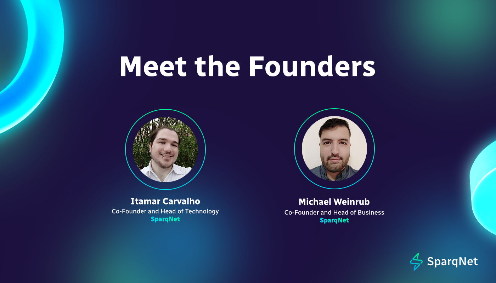

# Meet the Founders

Sparq Labs, the team behind [SparqNet](http://sparq.network/), gets its leadership from our two wonderful co-founders: [Itamar Carvalho](https://www.linkedin.com/in/itamar-carvalho-pinto-salomao?originalSubdomain=br) (Head of Technology) and [Michael Weinrub](https://www.linkedin.com/in/michael-weinrub) (Head of Business).

<figure><figcaption>
SparqNet Founders Itamar Carvalho and Michael Weinrub
</figcaption></figure>

With well over 20 years of experience between them, Ita and Michael are deeply committed to redefining the blockchain space, particularly in terms of delivering the fastest on-chain speed and subnet-enabled cross-chain integration for more scalable Web3 projects.

The duo has a strong shared vision of creating a [language-agnostic solution](https://medium.com/@SparqNet/why-language-agnostic-blockchains-like-sparqnet-are-the-future-of-web3-ff3beea80285?source=user\_profile---------7----------------------------) that is flexible, scalable, and interoperable from day zero. Both are determined to alleviate the worry and “what if’s” for developers looking to build the next generation of decentralized applications.

Previously to founding Sparq Labs, Itamar was working on AVME — a decentralized security suite platform (that includes an antivirus, VPN, password manager, etc.) and the first desktop wallet for Avalanche.

“Initially, AVME was going to be a subnet and its core protocol was to be closed for only AVME, but after further discussion we realized that this core could be open to any developer looking to bring applications that previously were too expensive to run in a decentralized manner to life,” Itamar says.

Michael has a background building startups mostly in the internet services industry, having started his first company at the tender age of 14.

“I had a few years working at Microsoft bringing Microsoft cloud and hardware to the market. I have also been an early adopter of cryptocurrency since the very early days of Bitcoin when you could mine it with a CPU,” Michael revealed.

“We saw the opportunity to build the AVME initial core within the Avalanche Summit Hackathon 2022,” says Itamar. “After concluding it and noticing the superb performance we were achieving with a pre-alpha prototype, we realized that this core could be open to everyone else and thus Sparq (*now SparqNet*) was born.”

“We were building very similar things. Itamar needed flexibility for infrastructure that existed in Web2, and I needed speed for building real-world products/services on-chain”, Michael explains. “We merged our frameworks knowing that if we needed such architecture, there were definitely others out there that needed it too — and it turns out, we were right!”

Learn more about SparqNet's journey in [this founders' AMA](https://medium.com/@SparqNet/meet-the-founders-who-are-the-people-behind-sparqnet-ef21e0751e55).
