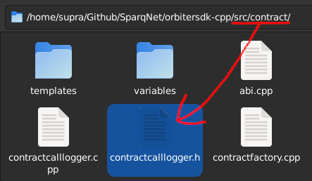

# The contract folder

This subchapter contains a brief overview of each one of the components inside the `src/contract` folder. See "How contracts work" for a more general information on smart contracts.

### ABI

<figure><figcaption></figcaption></figure>

The `src/contract/abi.h` file contains the **ABI** namespace - helper functions for handling Solidity ABI types and data natively, as well as the encoding and decoding of said data.

### BaseContract

<figure><figcaption></figcaption></figure>

The `src/contract/contract.h` file contains the **BaseContract** class - the base from which all smart contracts are derived - as well as the **ContractGlobals** and **ContractLocals** helper classes that provide access to global and local variables, respectively, for those contracts to work.

### ContractCallLogger

<figure><figcaption></figcaption></figure>

The `src/contract/contractcalllogger.h` file contains the **ContractCallLogger** class - it manages temporary data from contract nested call chains, such as used SafeVariables and altered balances, acting as the one who effectively decides whether those changes are commited or reverted during a contract call.

### ContractFactory

<figure><figcaption></figcaption></figure>

The `src/contract/contractfactory.h` file contains the **ContractFactory** class - responsible for creating the contracts and deploying them to the blockchain (more specifically to the ContractManager class).

### ContractManager and ContractManagerInterface

<figure><figcaption></figcaption></figure>

The `src/contract/contractmanager.h` contains the **ContractManager** and **ContractManagerInterface** classes - they represent the bulk of the contract functionality in OrbiterSDK.

_ContractManager_ is responsible for maintaining all deployed contracts within the blockchain, while _ContractManagerInterface_ is responsible for handling communications between contracts and the contract manager itself.

### CustomContracts

<figure><figcaption></figcaption></figure>

The `src/contract/customcontracts.h` file contains a tuple that holds all the registered contracts within the blockchain. It is also used as a reference for generating the ABI of said contracts.

### DynamicContract

<figure><figcaption></figcaption></figure>

The `src/contract/dynamiccontract.h` file contains the **DynamicContract** class - the base from which all Dynamic Contracts are derived (while _BaseContract_ is mainly used for Protocol Contracts).

### Event and EventManager

<figure><figcaption></figcaption></figure>

The `src/contract/event.h` file contains the **Event** and **EventManager** classes, as well as the **EventContainer** typedef for indexing - they represent the subset of contract functionality related to Solidity events.

_Event_ is responsible for abstracting a Solidity event's structure and data, while _EventManager_ is responsible for maintaining all emitted events within the blockchain.

### The variables subfolder

<figure><figcaption></figcaption></figure>

The `src/contract/variables` subfolder contains implementations for SafeVariables - special classes that abstract safe versions of variables used within contracts.

### The templates subfolder

<figure><figcaption></figcaption></figure>

The `src/contract/templates` subfolder contains several contracts used as templates, examples and for internal testing purposes. It's also meant to be the folder where user-coded contracts are stored.
