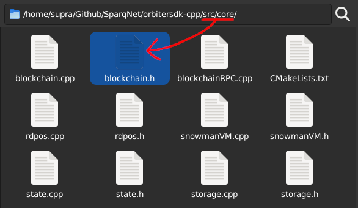
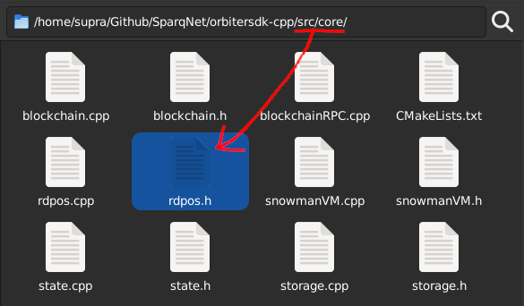
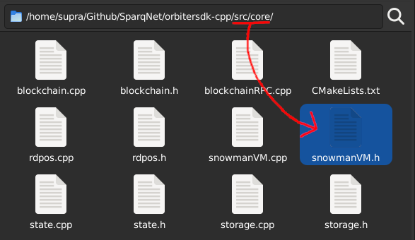
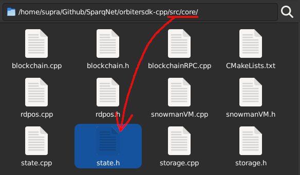
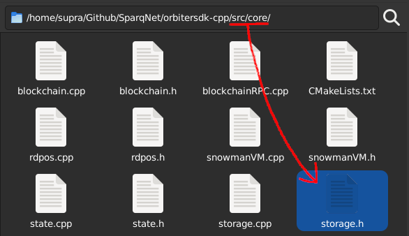

# The core folder

This subchapter contains a brief overview of each one of the components inside the `src/core` folder.

### Blockchain and Syncer

<figure><figcaption></figcaption></figure>

The `src/core/blockchain.h` file contains the **Blockchain** and **Syncer** classes.

The **Blockchain** class acts as the mother class that unites all the other components described throughout the docs, including the Syncer. Think of it as "the power button on Sparq's PC case" - its objective is to be the entry point of the system and act as a mediator for the other components, passing data around to each other, such as (but not limited to):

* The global options singleton
* The database
* The blockchain history/storage (for blocks and contract events)
* The blockchain state
* The rdPoS protocol
* The HTTP and P2P servers
* The SnowmanVM abstraction layer (for interfacing with AvalancheGo) - not present at the moment

The **Syncer** class is responsible for syncing the blockchain with other nodes in the network, as well as doing the proper transaction broadcasts and block creations (if the node happens to be a Validator).

### rdPoS

<figure><figcaption></figcaption></figure>

The `src/core/rdpos.h` file contains the **rdPoS** class - the implementation of the _Random Deterministic Proof of Stake_ algorithm used by the Sparq network - as well as the **rdPoSWorker** and **Validator** classes. rdPoS is also considered a smart contract, but remains part of the Sparq core protocol.

### SnowmanVM

<figure><figcaption></figcaption></figure>

The `src/core/snowmanvm.h` file contains the **SnowmanVM** class - the abstraction of an interface to communicate with the AvalancheGo ecossystem. At the moment it's not implemented due to internal complications, but is planned to at some time in the future.

The class is responsible for controlling blocks received through the AvalancheGo network and contains information such as the preferred block (chosen by the network), if the block is being processed, if it was approved or rejected. When a block reaches consensus (as in, it stops being "processed" and is either "approved" or "rejected"), it is removed from here and properly discarded (if rejected) or moved to the storage (if approved). A block that was already received before can't be accepted anymore. This applies to every status a block can be in, and to prevent that from happening, the status of all received blocks is stored in a list (`cachedBlockStatus`).

### State

<figure><figcaption></figcaption></figure>

The `src/core/state.h` file contains the **State** class - an abstraction of the blockchain's current state of accounts, balances, nonces, transactions, token balances, contracts and events emitted at the current block in the network, responsible for maintaining it and a few other shared inner variables.

A node's state and its data can only be altered through the process of block creation, either by creating a block itself, or receiving one from the network. In Sparq's case, the class is often used for querying account data (current balance and nonce) and also processing and validating blocks and their transactions, following requirements such as (not limited to, but those are some of the most common):

* Ensuring replay protection (e.g. checking if the transaction has already been validated)
* Checking if the sender address exists and has enough balance to make the transaction
* Checking if the sender address nonce is valid (if it matches what was sent in the transaction)
* Checking if the transaction is not already in the mempool, thus avoiding double spends

Not all functions from the class update the state. Check the [Doxygen](https://doxygen.nl) docs for more info on that.

### Storage

<figure><figcaption></figcaption></figure>

The `src/core/storage.h` file contains the **Storage** class - an abstraction of the blockchain's history, maintaining a collection of blocks approved and validated by the network, other nodes, or itself through time. Those blocks store transactions, contracts, accounts, and can't be altered once they're in the blockchain, only searched for or read from.

On node initialization, a history of up to 1000 of the most recent blocks is loaded into memory. Those blocks were stored in a previous initialization in the database. If there are no blocks (e.g. the blockchain was just deployed and initialized for the first time), a "genesis" block is automatically created and loaded in memory.

Once a block and its transactions are received from the network, they're stored in memory. If more than 1000 blocks (or 1 million transactions) are stored in memory at a given time, older blocks are periodically saved to the database. This makes the blockchain lightweight memory-wise and extremely responsive.

Searching for and reading from blocks in history is done in several places in the system, so we can say the Storage and DB classes, when working together, are the end point of the blockchain's operations history.
