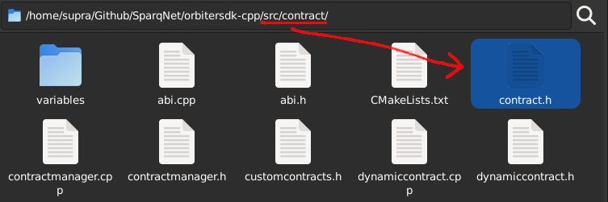

# How to code a precompiled contract

When creating precompiled contracts for AppLayer, there are a few rules that must be followed to ensure they work as intended. While each contract type has its own rules, some other rules apply to both. This will be explained and demonstrated further.

## General contract rules

As a general stance, contracts must:

* Inherit from their respective base class, depending on their type (see below) and make sure you're passing the right arguments for their constructors
* Implement, initialize and manage variables within the state and database during contract construction (loading) *and* destruction (saving), and the required view and non-view functions that manage them
* Register callbacks for contract functions with their proper functors/signatures (if functions are called by an RPC `eth_call` or a transaction)
* Ensure that their assigned name and their own class name match - both contract constructors take a `contractName` string as an argument, i.e. if your contract is called "TestContract", your constructor's definition would be `TestContract(...) : DynamicContract(interface, "TestContract", ...)` - *both names HAVE to match*, otherwise a segfault may happen
* Declare view functions, non-view functions and events (if they exist) correctly, accoding to their specific types (explained further)

### Rules for Protocol Contracts

Protocol Contracts specifically must:

* Inherit `BaseContract` from `src/contract/contract.h`:

<figure><figcaption></figcaption></figure>

* Override `ethCall()` functions to parse transaction arguments, manage state changes during their processing (depending on whether the call is committing or not), and commit/revert variables when necessary

### Rules for Dynamic Contracts

Dynamic Contracts specifically must:

* Inherit `DynamicContract` from `src/contract/dynamiccontract.h`and any type of SafeVariable used from the `src/contract/variables` folder:

<figure><figcaption></figcaption></figure>

* Provide a `ConstructorArguments` tuple with the contract's constructor argument types for registering the contract, and two registering functions: `registerContract()` and `registerContractFunctions()`, for contract metadata, variables, functions, and events (both of which should be called inside the contract's constructor)
* Provide two constructors: one for creating the contract from scratch within `ContractManager`, and one for loading the contract from the database
* Only allow contract creation through a transaction call to the `ContractManager` contract
* Develop functions for handling your contract's creation and logic
* Override `ethCall()` functions to register and properly call those functions
* Set **all** of the contract's internal variables as `private`, inherit them from one of the many SafeVariable classes, and always reference them with `this` to ensure correct semantics - e.g. `string name` and `uint256 value` in Solidity should be `SafeString name` and `SafeUint256_t value` in C++, respectively - referencing them in your definition would be `this->name`, `this->value`, so on and so forth
* Allow loops using containers such as `SafeUnorderedMap`, but keep in mind how safe containers work
  * e.g. when you access a key from a `SafeUnorderedMap`, it'll check if it exists and copy *only* the key, not the entire map or its value - thus when iterating a loop, you can't assume the "temporary" value is the original one
  * We recommended you only loop inside *view* functions to ensure value safety, but you can do it on non-view functions as well, just be careful when doing so
* Trigger state changes only via transaction calls to contract functions
* Call `updateState(true)` at the end of the contract's constructor

## Inherited functions and variables

Every contract within AppLayer's BDK inherits from the following classes, which means they can use their functions anywhere in their logic. Check the [Doxygen](https://doxygen.nl) docs for more details on each function's implementation, parameters, returns and overloads.

* **ContractGlobals** - global variables accessible through transaction/RPC calls, set by the State when calling the contract

| Function          | Description                                         |
| ----------------- | --------------------------------------------------- |
| getCoinbase       | Get the coinbase address (creator of current block) |
| getBlockHash      | Get the current block hash                          |
| getBlockHeight    | Get the current block height                        |
| getBlockTimestamp | Get the current block timestamp                     |

* **ContractLocals** - local variables accessible through transaction/RPC calls, set by `ContractManager` when calling the contract

| Function  | Description                  |
| --------- | ---------------------------- |
| getOrigin | Get the transaction's origin |
| getCaller | Get the transaction's caller |
| getValue  | Get the transaction's value  |

* **BaseContract** - base class for all contracts, provides and stores the respective contract's information

| Function           | Description                                                         |
| ------------------ | ------------------------------------------------------------------- |
| getContractAddress | Get the contract's address                                          |
| getContractCreator | Get the contract's owner                                            |
| getContractChainId | Get the contract's chainId                                          |
| getContractName    | Get the contract's name                                             |
| getDBPrefix        | Get the contract's database prefix                                  |
| getNewPrefix       | Same as getDBPrefix() but with a user-defined prefix appended to it |

**For Dynamic Contracts specifically**, you can also use the following:

| Function                 | Description                            |
| ------------------------ | -------------------------------------- |
| emitEvent                | Emit an event                          |
| isPayableFunction        | Check if a function is payable or not  |
| getContract              | Get a pointer to a contract            |
| callContractViewFunction | Call a contract's view function        |
| callContractFunction     | Call a contract's non-view function    |
| callCreateContract       | Call a contract's create function      |
| getBalance               | Get the current balance of an address  |
| sendTokens               | Send an amount of tokens to an address |
