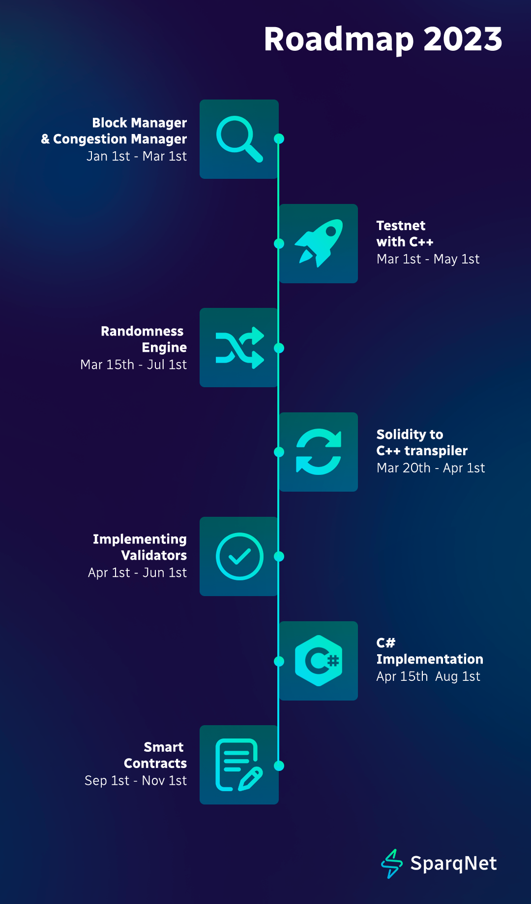

# Roadmap

During the [Avalanche Summit Hackathon 2022](https://medium.com/@SparqNet/climbing-to-the-summit-sparqnets-origin-story-7b3d840d146c?source=user\_profile---------0----------------------------), we made a major breakthrough regarding how quickly we could set up a subnet using the Avalanche infrastructure.

However, we still noticed some EVM-related limitations that can compound into a less satisfying experience for both developers and end-users.&#x20;

On the surface, AppLayer may be summarily perceived as technology for building subnets in C++, but the mission is much broader. Throughout our development efforts, we’ve explored various possibilities, such as:

* Converting smart contracts written in other languages to C++
* Bridging internal subnets to external EVM-based blockchains
* More efficient/performance-friendly signature verification
* Circumventing gas limits with a static blockchain skeleton
* Enabling programming in other languages like Rust, Go and JavaScript
* A more randomized approach to Proof-of-Stake
* and many more…

In the near future, we will be covering some crucial targets on our roadmap to gradually merge all these concepts.

## Roadmap

<figure><figcaption></figcaption></figure>

**Please note:** The information provided above is subject to further modifications to reflect the evolving development work.
