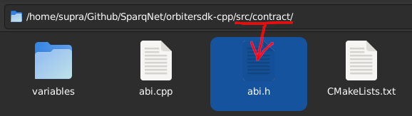

# Solidity ABI

AppLayer is primarily a *native, pre-compiled* blockchain, which means its main focus is to run without the need for an EVM. However, the vast majority of the smart contract ecosystem operates and depends on [Solidity](https://docs.soliditylang.org/en/latest) - not only the contracts themselves but also the data they share across each other.

When developing pre-compiled contracts, AppLayer makes use of an abstraction of Solidity's ABI encoding and decoding processes to properly translate between native and non-native data types. The **ABI** namespace, declared in `src/contract/abi.h`, contains several functions for Solidity ABI-related operations, for managing and manipulating data in Solidity format.

<figure><figcaption><p>Source file for AppLayer's Solidity ABI logic</p></figcaption></figure>

This is only an overview, check the [Doxygen](https://doxygen.nl) docs for more details on how those functions work.

### Solidity types

The **Types** enum contains the supported Solidity data types in the ABI. Each value has an intrinsic equivalency with both the Solidity data type and the native C++ data type that it represents.

TODO: gone? -> **BaseTypes** is a `std::variant` declared in `src/utils/utils.h` that abstracts all of the types in one typedef, for easier handling.

Replace the **X** in "uintX" and "intX" with the desired size number. The ABI supports every size from 8 to 256 (inclusive), in multiples of 8 (e.g. 8, 16, 24, 32, 40, 48, ..., until 256) - in other words, `x <= 256 && x % 8 == 0`. **Enums are encoded as uint8**.

|    Enum    |  Solidity  |            C++            |
| :--------: | :--------: | :-----------------------: |
|    intX    |    intX    |          intX\_t          |
|   intXArr  |   intX\[]  |   std::vector\<intX\_t>   |
|    uintX   |    uintX   |          uintX\_t         |
|  uintXArr  |  uintX\[]  |   std::vector\<uintX\_t>  |
|   address  |   address  |          Address          |
| addressArr | address\[] |        std::vector        |
|   boolean  |    bool    |            bool           |
| booleanArr |   bool\[]  |        std::vector        |
|    bytes   |    bytes   |           Bytes           |
|  bytesArr  |  bytes\[]  |        std::vector        |
|   string   |   string   |        std::string        |
|  stringArr |  string\[] | std::vector\<std::string> |
|    enum    |    enum    |          uint8\_t         |

### MethodDescription and EventDescription

The **MethodDescription** and **EventDescription** structs abstract, respectively, the structures for a given Solidity method and Solidity event, such as their name, type, inputs and outputs, state mutability, anonymity and indexations. Those are used extensively by `ContractReflectionInterface` and `JsonAbi`, to make it easier to pass data around when performing actions like registering the contract and generating ABI for events.

### Encoding and decoding

Encoding and decoding ABI data is done by calling the `ABI::Encoder::encodeData()` and `ABI::Decoder::decodeData()` functions, respectively. The encode function asks for one or more native C++ types, returning a `Bytes` object that is the encoded ABI string. The decode function does the inverse, asking for a `Bytes` object with the ABI encoded data (and optionally an index for said data) and returning a `std::tuple` with the decoded native C++ types.

If encoding a function call, its signature (also called "functor" - the first 4 bytes of `keccak(functionSignature)`) can be encoded with `ABI::FunctorEncoder::encode()`, passing the function's name and its arguments along the template.

Here's an example:

```cpp
// Encoding
Bytes enc = ABI::FunctorEncoder::encode<uint256_t, Address>("transfer").asBytes();
Utils::appendBytes(enc, ABI::Encoder::encodeData(
  uint256_t(1000000000000000000),
  Address(std::string("0x1a2b3c4d5e6f7e8d9c0b1a2b3c4d5e6f7e8d9c0b"), false)
));
std::cout << Hex::fromBytes(enc).get() << std::endl;
$ b7760c8f0000000000000000000000000000000000000000000000000de0b6b3a76400000000000000000000000000001a2b3c4d5e6f7e8d9c0b1a2b3c4d5e6f7e8d9c0b

// Decoding
Bytes data = Hex::toBytes("0000000000000000000000000000000000000000000000000de0b6b3a76400000000000000000000000000001a2b3c4d5e6f7e8d9c0b1a2b3c4d5e6f7e8d9c0b");
auto dec = ABI::Decoder::decodeData<uint256_t, Address>(data);
std::cout << std::get<0>(dec) << std::endl << std::get<1>(dec).hex().get() << std::endl;
$
1000000000000000000
"1a2b3c4d5e6f7e8d9c0b1a2b3c4d5e6f7e8d9c0b"
```
