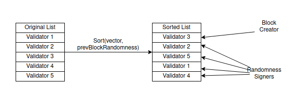
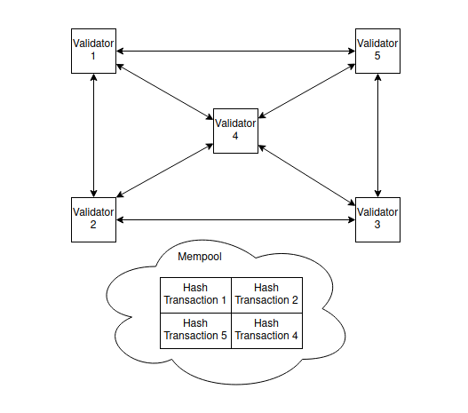
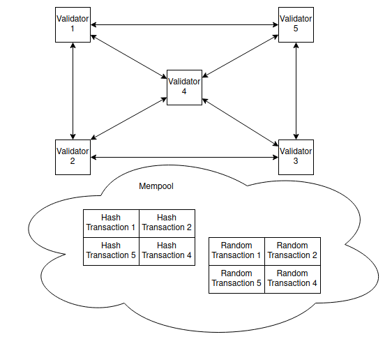
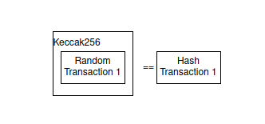
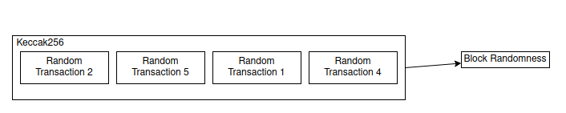
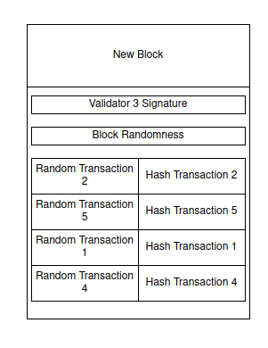

# How rdPoS works

The heart of rdPoS is RandomGen, a deterministic uint256\_t generator used for almost everything related to consensus. This deterministic randomness ensures that every node has a chance to respond to a given request (block, randomness, bridging, etc.), while making sure that the nodes selected from the network are truly random and not problematic nodes operated by a malicious actor.

For RandomGen to be viable, it needs to be seeded with a truly random number. Our solution for that is as follows:

* Every time a new block is about to be created, 16 random nodes are selected using RandomGen with the previous block’s randomness seed.
* These nodes make a 32-byte random string (`RandomnessSeed`) and hash it (`RandomnessHash`), then sign the hash and publish it to the network.
* After all the nodes have signed and published their hashes to the network, they can publish the real data, verifying that no one is trying to manipulate the end result.
* After the data is published and included in the block, the randomness seeds are concatenated and hashed, and the resulting hash is used to seed the next block creation.

We have to pay attention to the current state of RandomGen to ensure that all nodes are always in the same internal state so they can properly synchronize with each other.

#### Flux of the rdPoS algorithm during block creation

A block in an rdPoS network is created by the following rules:

* A list of network Validators is randomly generated and sorted using the "randomness" seed from the previous block.

<figure><figcaption>
New random Validator list being created
</figcaption></figure>

* The first Validator from the list will be the block creator, while at least 4 others will create a random 32-byte string and make two transactions with it: one containing the hash of said string, and another containing the string itself, both signed.

<figure><figcaption>
Validators performing a hash transaction broadcast
</figcaption></figure>

<figure><figcaption>
Validators performing a random transaction broadcast
</figcaption></figure>

* The hashes are verified to make sure they match their respective random strings.

<figure><figcaption>
Transactions are checked against each other
</figcaption></figure>

* A new block is created by the first Validator, concatenating and hashing the other Validators' random strings to create a new "randomness" seed that will be used at the next block.

<figure><figcaption>
New randomness seed is generated
</figcaption></figure>

<figure><figcaption>
New block is created with randomness seed, Validator signature and the transactions
</figcaption></figure>

* The block is signed and published to the network by the first Validator, while the other Validators verify that all transaction signatures (random and hashed) correspond with the list created at the start.
* The genesis block (the very first block in the chain) enforces a given fixed randomness to be valid, since there is no previous block before genesis to derive the randomness from. Additionally, at least five hardcoded Validators are needed to bootstrap the network, since each block requires at least 4 Validators to confirm the string and hash transaction signatures, and one for signing the block itself.&#x20;

As quoted by [Supra](https://github.com/Jean-Lessa): _"It's like playing poker but everyone hashes their hands first before showing the real cards"_.
